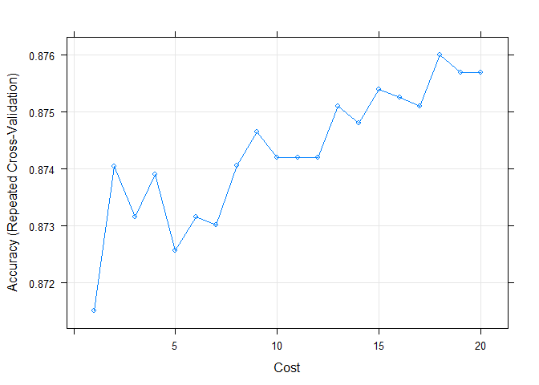

R Notebook
================

``` r
set.seed(12010)
setwd("C:/Users/coolj/Documents/Predictive/Project/Final-Project/")
df<-read.csv('ProjectData.csv', header = TRUE, sep=",")

df <- df %>%
  janitor::clean_names()

df
```

    ##     i_year franch_id last_year_rank last_year_playoff last_year_w
    ## 1     1971       MTL              3                 1   0.2948718
    ## 2     1988       DAL              5                 0   0.6000000
    ## 3     1989       COL              5                 0   0.5750000
    ## 4     2003       PIT              5                 0   0.5365854
    ## 5     2009       NYI              5                 0   0.5731707
    ## 6     2010       EDM              5                 0   0.5731707
    ## 7     1998       TBL              7                 0   0.6707317
    ## 8     1975       PHI              1                 1   0.2250000
    ## 9     1980       MTL              1                 1   0.2500000
    ## 10    1982       BOS              2                 1   0.3375000
    ## 11    1983       DAL              2                 1   0.3000000
    ## 12    2001       WPG              4                 0   0.5487805
    ## 13    1976       WAS              5                 0   0.7375000
    ## 14    1978       DAL              5                 0   0.6625000
    ## 15    1987       BUF              5                 0   0.5500000
    ## 16    1994       FLO              5                 0   0.4047619
    ## 17    2008       TBL              5                 0   0.5121951
    ## 18    1981       PHO              6                 0   0.7125000
    ## 19    1993       OTT              6                 0   0.8333333
    ## 20    1997       BOS              6                 0   0.5731707
    ## 21    1973       NYI              8                 0   0.7692308
    ## 22    2007       CHI              5                 0   0.5121951
    ## 23    1977       DET              5                 0   0.6875000
    ## 24    1990       COL              5                 0   0.7625000
    ## 25    1991       COL              5                 0   0.6250000
    ## 26    2011       EDM              5                 0   0.5487805
    ## 27    1984       PIT              6                 0   0.7250000
    ## 28    1985       TOR              5                 0   0.6500000
    ## 29    1986       DET              5                 0   0.7125000
    ## 30    2000       NYI              5                 0   0.5853659
    ## 31    2002       CBS              5                 0   0.5731707
    ## 32    2006       STL              5                 0   0.5609756
    ## 33    1995       OTT              7                 0   0.7083333
    ## 34    1996       OTT              6                 0   0.7195122
    ## 35    2010       BOS              3                 1   0.3658537
    ## 36    1988       VAN              5                 0   0.5750000
    ## 37    2003       CAR              5                 0   0.5243902
    ## 38    2009       TBL              5                 0   0.4878049
    ## 39    1989       NYI              6                 0   0.5875000
    ## 40    1971       DET              7                 0   0.5769231
    ## 41    1982       DAL              1                 1   0.2875000
    ## 42    2001       OTT              1                 1   0.2560976
    ## 43    1981       LAK              2                 1   0.3000000
    ## 44    1976       PIT              3                 1   0.4125000
    ## 45    1994       ANA              4                 0   0.5476190
    ## 46    1999       VAN              4                 0   0.5731707
    ## 47    1975       NJD              5                 0   0.6750000
    ## 48    1978       WAS              5                 0   0.6125000
    ## 49    1980       PHO              5                 0   0.6125000
    ## 50    2008       LAK              5                 0   0.5243902
    ## 51    1987       NJD              6                 0   0.5625000
    ## 52    1997       SJS              7                 0   0.5731707
    ## 53    2011       COL              4                 0   0.5365854
    ## 54    1984       NJD              5                 0   0.7000000
    ## 55    1990       VAN              5                 0   0.5125000
    ## 56    2007       PHI              5                 0   0.5853659
    ## 57    1979       STL              3                 0   0.6250000
    ## 58    1986       LAK              5                 0   0.6125000
    ## 59    2000       WPG              5                 0   0.6951220
    ## 60    2002       WPG              5                 0   0.5731707
    ## 61    2006       PIT              5                 0   0.5609756
    ## 62    1985       PIT              6                 0   0.6375000
    ## 63    1995       NYI              7                 0   0.5833333
    ## 64    1996       SJS              7                 0   0.6707317
    ## 65    1998       SJS              4                 1   0.4634146
    ## 66    2003       FLO              4                 0   0.4390244
    ## 67    1988       COL              5                 0   0.5375000
    ## 68    1989       TOR              5                 0   0.5750000
    ## 69    2009       COL              5                 0   0.5487805
    ## 70    2010       FLO              5                 0   0.4512195
    ## 71    1971       VAN              6                 0   0.5897436
    ## 72    1980       CHI              1                 1   0.3375000
    ## 73    1983       NYI              2                 1   0.3250000
    ## 74    1987       BOS              3                 1   0.4250000
    ## 75    1976       DAL              4                 0   0.6625000
    ## 76    1978       STL              4                 0   0.5875000
    ## 77    2008       WPG              4                 0   0.4878049
    ## 78    1981       WAS              5                 0   0.4500000
    ## 79    1982       TOR              5                 0   0.5500000
    ## 80    2001       TBL              5                 0   0.5731707
    ## 81    1993       TBL              6                 0   0.6428571
    ## 82    1997       LAK              6                 0   0.5243902
    ## 83    1973       VAN              7                 0   0.6025641
    ## 84    1994       OTT              7                 0   0.7261905
    ## 85    1984       CHI              4                 1   0.5250000
    ## 86    1977       WAS              4                 0   0.5250000
    ## 87    1991       NJD              4                 1   0.4125000
    ## 88    1990       DET              5                 0   0.4750000
    ## 89    2007       PHO              5                 0   0.5609756
    ## 90    2011       FLO              5                 0   0.4878049
    ## 91    1992       SJS              6                 0   0.7250000
    ## 92    1972       VAN              7                 0   0.6410256
    ## 93    1995       LAK              4                 0   0.4791667
    ## 94    2006       CHI              4                 0   0.5243902
    ## 95    2002       FLO              4                 0   0.5365854
    ## 96    1979       DET              5                 0   0.5125000
    ## 97    1985       NJD              5                 0   0.6000000
    ## 98    1986       NJD              6                 0   0.6125000
    ## 99    1996       NYI              7                 0   0.6097561
    ## 100   1971       STL              2                 1   0.3205128
    ## 101   2009       WPG              4                 0   0.5000000
    ## 102   1989       PHO              5                 0   0.5250000
    ## 103   2003       CBS              5                 0   0.5121951
    ## 104   2010       CBS              5                 0   0.4268293
    ## 105   1988       PIT              6                 0   0.4375000
    ## 106   1998       VAN              7                 0   0.5243902
    ## 107   1980       LAK              2                 1   0.4500000
    ## 108   1978       VAN              3                 0   0.5375000
    ## 109   1982       PHI              3                 1   0.3875000
    ## 110   2001       FLO              3                 0   0.4634146
    ## 111   1975       DAL              4                 0   0.6250000
    ## 112   1976       DET              4                 0   0.5500000
    ## 113   1987       LAK              4                 1   0.5125000
    ## 114   1999       NYR              4                 0   0.4634146
    ## 115   1983       DET              5                 0   0.5500000
    ## 116   2008       STL              5                 0   0.4390244
    ## 117   1973       TOR              6                 0   0.5256410
    ## 118   1994       EDM              6                 0   0.5357143
    ## 119   1997       NYI              7                 0   0.5000000
    ## 120   1974       NYI              8                 0   0.5256410
    ## 121   1972       MTL              3                 1   0.2051282
    ## 122   1977       VAN              4                 0   0.5250000
    ## 123   2007       LAK              4                 0   0.5000000
    ## 124   2011       NJD              4                 0   0.4756098
    ## 125   1984       TOR              5                 0   0.5625000
    ## 126   1992       COL              5                 0   0.6000000
    ## 127   1990       PHI              6                 0   0.4875000
    ## 128   1991       NYI              6                 0   0.5625000
    ## 129   2002       PHI              1                 1   0.3292683
    ## 130   1979       WAS              4                 0   0.5125000
    ## 131   1985       VAN              5                 0   0.5750000
    ## 132   1986       PIT              5                 0   0.4750000
    ## 133   2006       WAS              5                 0   0.5000000
    ## 134   1995       ANA              6                 0   0.5625000
    ## 135   1996       WAS              4                 1   0.3902439
    ## 136   1971       BUF              5                 0   0.5000000
    ## 137   1989       NJD              5                 0   0.5125000
    ## 138   2003       BUF              5                 0   0.4512195
    ## 139   2009       LAK              5                 0   0.4512195
    ## 140   2010       NYI              5                 0   0.4512195
    ## 141   1998       ANA              6                 0   0.5243902
    ## 142   1974       MTL              2                 1   0.3076923
    ## 143   1983       BUF              3                 1   0.3625000
    ## 144   1973       STL              4                 1   0.4358974
    ## 145   1975       DET              4                 0   0.5625000
    ## 146   1980       WAS              5                 0   0.5000000
    ## 147   1982       WAS              5                 0   0.5125000
    ## 148   1987       PIT              5                 0   0.4750000
    ## 149   1999       NYI              5                 0   0.5853659
    ## 150   2001       ANA              5                 0   0.5000000
    ## 151   2008       TOR              5                 0   0.4268293
    ## 152   1984       MTL              4                 1   0.5000000
    ## 153   1990       PIT              5                 0   0.5000000
    ## 154   1991       PHO              5                 0   0.5375000
    ## 155   1992       NYI              5                 0   0.4375000
    ## 156   2007       WAS              5                 0   0.4878049
    ## 157   2011       NYI              5                 0   0.4756098
    ## 158   1972       BUF              6                 0   0.5512821
    ## 159   1979       VAN              2                 1   0.5250000
    ## 160   1986       BUF              5                 0   0.4625000
    ## 161   2002       PIT              5                 0   0.5000000
    ## 162   2006       BOS              5                 0   0.4512195
    ## 163   1995       TBL              6                 0   0.5833333
    ## 164   1996       DAL              6                 0   0.5121951
    ## 165   1971       BOS              1                 1   0.1794872
    ## 166   1989       CHI              4                 1   0.5125000
    ## 167   1988       TOR              4                 1   0.6125000
    ## 168   2009       PHO              4                 0   0.4756098
    ## 169   2010       TBL              4                 0   0.4390244
    ## 170   1998       CAL              5                 0   0.5000000
    ## 171   2003       SJS              5                 0   0.4512195
    ## 172   1973       BOS              2                 1   0.2820513
    ## 173   1978       PHI              2                 1   0.2500000
    ## 174   1975       TOR              3                 1   0.4125000
    ## 175   1982       BUF              3                 1   0.3250000
    ## 176   1976       NYR              4                 0   0.5250000
    ## 177   1980       EDM              4                 1   0.4875000
    ## 178   1999       NAS              4                 0   0.5731707
    ## 179   2008       CBS              4                 0   0.4390244
    ## 180   1981       TOR              5                 1   0.4625000
    ## 181   1983       NJD              5                 0   0.6125000
    ## 182   1987       DAL              5                 0   0.5000000
    ## 183   1997       CAL              5                 0   0.5000000
    ## 184   2001       MIN              5                 0   0.4756098
    ## 185   1993       SJS              6                 0   0.8452381
    ## 186   1974       DAL              7                 0   0.4871795
    ## 187   1977       CHI              3                 1   0.5375000
    ## 188   1990       NYI              4                 1   0.4750000
    ## 189   1984       LAK              5                 0   0.5500000
    ## 190   1991       PHI              5                 0   0.4625000
    ## 191   1992       CAL              5                 0   0.4625000
    ## 192   2007       EDM              5                 0   0.5243902
    ## 193   2011       OTT              5                 0   0.4878049
    ## 194   1985       NYI              3                 1   0.4250000
    ## 195   2006       CBS              3                 0   0.5243902
    ## 196   1979       DAL              4                 0   0.5000000
    ## 197   1986       TOR              4                 1   0.6000000
    ## 198   2000       NAS              4                 0   0.4878049
    ## 199   2002       NAS              4                 0   0.5000000
    ## 200   1995       EDM              5                 0   0.5625000
    ## 201   1996       EDM              5                 0   0.5365854
    ## 202   1989       DAL              3                 1   0.4625000
    ## 203   2010       CAR              3                 0   0.4512195
    ## 204   1988       LAK              4                 1   0.5250000
    ## 205   2003       NAS              4                 0   0.4268293
    ## 206   1998       NYR              5                 0   0.4756098
    ## 207   2009       TOR              5                 0   0.4268293
    ## 208   1975       CHI              3                 1   0.4375000
    ## 209   1981       MTL              1                 1   0.2750000
    ## 210   1982       CHI              4                 1   0.4750000
    ## 211   2008       NAS              2                 1   0.3902439
    ## 212   1976       STL              3                 1   0.4625000
    ## 213   1980       VAN              3                 1   0.4625000
    ## 214   1983       TOR              3                 1   0.5000000
    ## 215   1999       WAS              3                 0   0.5487805
    ## 216   1987       TOR              4                 1   0.5250000
    ## 217   1973       PIT              5                 0   0.4743590
    ## 218   1993       EDM              5                 0   0.5952381
    ## 219   1994       LAK              5                 0   0.5357143
    ## 220   2001       MTL              5                 0   0.4878049
    ## 221   1997       TBL              6                 0   0.4878049
    ## 222   1977       DAL              2                 1   0.4875000
    ## 223   1984       DET              3                 1   0.5250000
    ## 224   1990       LAK              4                 1   0.4875000
    ## 225   1991       VAN              4                 1   0.5375000
    ## 226   2007       CBS              4                 0   0.5121951
    ## 227   1972       PHI              5                 0   0.4871795
    ## 228   1992       PHI              6                 0   0.4625000
    ## 229   1979       CHI              1                 1   0.4500000
    ## 230   1985       NYR              4                 1   0.5500000
    ## 231   1986       VAN              4                 1   0.5500000
    ## 232   2006       NYI              4                 0   0.4878049
    ## 233   2000       BOS              5                 0   0.4024390
    ## 234   2002       ANA              5                 0   0.5121951
    ## 235   1995       PHO              6                 0   0.5208333
    ## 236   1996       BUF              5                 0   0.5121951
    ## 237   1988       CHI              3                 1   0.5125000
    ## 238   2010       WPG              2                 0   0.4146341
    ## 239   1971       PHI              3                 1   0.4230769
    ## 240   2003       WPG              3                 0   0.4756098
    ## 241   1998       CHI              5                 0   0.4756098
    ## 242   2009       DAL              3                 0   0.4268293
    ## 243   1989       VAN              4                 1   0.4875000
    ## 244   1973       MTL              1                 1   0.1282051
    ## 245   1978       MTL              1                 1   0.1250000
    ## 246   1987       CHI              3                 1   0.4625000
    ## 247   1981       EDM              4                 1   0.4375000
    ## 248   1983       PHO              4                 1   0.4875000
    ## 249   2008       PHO              4                 0   0.4512195
    ## 250   1974       PIT              5                 0   0.5256410
    ## 251   2001       CBS              5                 0   0.4756098
    ## 252   1993       NYR              6                 0   0.4642857
    ## 253   1994       TBL              7                 0   0.5119048
    ## 254   2011       PHI              1                 1   0.2804878
    ## 255   1977       NYR              4                 0   0.4625000
    ## 256   1990       DAL              4                 1   0.5000000
    ## 257   1991       DAL              4                 1   0.4875000
    ## 258   1992       TOR              5                 0   0.5375000
    ## 259   2007       BOS              5                 0   0.5000000
    ## 260   1979       BOS              1                 1   0.2875000
    ## 261   1985       DET              3                 1   0.5125000
    ## 262   1986       PHO              3                 1   0.5875000
    ## 263   2000       TBL              4                 0   0.5731707
    ## 264   2002       MIN              5                 0   0.4268293
    ## 265   2006       PHO              5                 0   0.4756098
    ## 266   1995       MTL              6                 0   0.4791667
    ## 267   1996       BOS              2                 1   0.3780488
    ## 268   1988       STL              2                 1   0.4750000
    ## 269   1989       STL              2                 1   0.4375000
    ## 270   1998       NYI              4                 0   0.5000000
    ## 271   2009       OTT              4                 0   0.4268293
    ## 272   2010       MIN              4                 0   0.4390244
    ## 273   2003       CAL              5                 0   0.4390244
    ## 274   1975       MTL              1                 1   0.1750000
    ## 275   1976       CHI              1                 1   0.3750000
    ## 276   1978       DET              2                 1   0.4250000
    ## 277   1980       PIT              3                 1   0.4625000
    ## 278   1983       VAN              3                 1   0.4375000
    ## 279   1981       NYR              4                 1   0.4500000
    ## 280   2001       CHI              4                 0   0.4878049
    ## 281   1987       COL              4                 1   0.4875000
    ## 282   1994       NYI              4                 1   0.4285714
    ## 283   1997       WAS              5                 0   0.4878049
    ## 284   2008       NYI              5                 0   0.4634146
    ## 285   1974       DET              6                 0   0.5000000
    ## 286   1977       STL              1                 1   0.4875000
    ## 287   2011       BOS              1                 1   0.3048780
    ## 288   2007       SJS              2                 1   0.3170732
    ## 289   1972       STL              3                 1   0.5000000
    ## 290   1990       WAS              3                 1   0.4750000
    ## 291   1979       TOR              3                 1   0.4125000
    ## 292   1995       BOS              3                 1   0.3750000
    ## 293   1985       LAK              4                 1   0.4000000
    ## 294   1986       NYR              4                 1   0.4750000
    ## 295   2000       CAL              4                 0   0.4390244
    ## 296   2006       MIN              5                 0   0.4390244
    ## 297   1996       ANA              4                 0   0.4756098
    ## 298   1971       NYR              2                 1   0.2307692
    ## 299   1988       PHO              3                 1   0.4500000
    ## 300   2003       MTL              4                 0   0.4268293
    ## 301   2009       EDM              4                 0   0.4268293
    ## 302   2010       NYR              4                 0   0.4024390
    ## 303   1998       TOR              6                 0   0.5243902
    ## 304   1975       VAN              1                 1   0.4000000
    ## 305   1978       CHI              1                 1   0.3625000
    ## 306   1993       COL              2                 1   0.3214286
    ## 307   1981       VAN              3                 1   0.4000000
    ## 308   1994       WAS              3                 1   0.4166667
    ## 309   1982       PIT              4                 1   0.4500000
    ## 310   1987       NYR              4                 1   0.4750000
    ## 311   1997       VAN              4                 0   0.4878049
    ## 312   2001       NYR              4                 0   0.5243902
    ## 313   2008       VAN              5                 0   0.4024390
    ## 314   1977       MTL              1                 1   0.1000000
    ## 315   1972       NYR              2                 1   0.2179487
    ## 316   1984       VAN              3                 1   0.4875000
    ## 317   1990       TOR              3                 1   0.4750000
    ## 318   1991       DET              3                 1   0.4750000
    ## 319   2011       MIN              3                 0   0.4268293
    ## 320   2007       FLO              4                 0   0.3780488
    ## 321   1986       STL              3                 1   0.4250000
    ## 322   2000       CHI              3                 0   0.4512195
    ## 323   2002       CAL              4                 0   0.4268293
    ## 324   2006       FLO              4                 0   0.4146341
    ## 325   1995       FLO              5                 0   0.4583333
    ## 326   1996       NJD              6                 0   0.4024390
    ## 327   1989       DET              1                 1   0.4250000
    ## 328   2003       PHI              2                 1   0.2439024
    ## 329   2009       NAS              5                 0   0.4146341
    ## 330   2010       DAL              5                 0   0.3780488
    ## 331   1998       CAR              6                 0   0.5000000
    ## 332   1982       VAN              2                 1   0.4125000
    ## 333   1987       DET              2                 1   0.4500000
    ## 334   1993       WAS              2                 1   0.4047619
    ## 335   1975       NYI              3                 1   0.3125000
    ## 336   1994       SJS              3                 1   0.4166667
    ## 337   1999       CAL              3                 0   0.4878049
    ## 338   1981       COL              4                 1   0.4000000
    ## 339   1997       MTL              4                 1   0.4390244
    ## 340   2001       PHO              4                 0   0.3292683
    ## 341   1973       DET              5                 0   0.3717949
    ## 342   1974       BUF              5                 0   0.4358974
    ## 343   1980       DET              5                 0   0.5375000
    ## 344   2008       CHI              3                 0   0.4146341
    ## 345   1990       CAL              1                 1   0.2875000
    ## 346   1977       TOR              3                 1   0.4000000
    ## 347   1992       BUF              3                 1   0.4625000
    ## 348   2007       CAR              3                 0   0.4146341
    ## 349   1972       TOR              4                 1   0.3974359
    ## 350   1979       BUF              2                 1   0.3500000
    ## 351   1985       CHI              2                 1   0.4375000
    ## 352   2006       LAK              4                 0   0.4268293
    ## 353   1995       DAL              5                 1   0.4791667
    ## 354   2002       BUF              5                 0   0.4268293
    ## 355   1971       CHI              1                 1   0.2564103
    ## 356   1998       COL              1                 1   0.3170732
    ## 357   1988       NJD              4                 1   0.4500000
    ## 358   2003       NYR              4                 0   0.4390244
    ## 359   2010       ANA              4                 0   0.3902439
    ## 360   1976       MTL              1                 1   0.1375000
    ## 361   1987       STL              1                 1   0.4125000
    ## 362   1981       CHI              2                 1   0.4125000
    ## 363   1975       NYR              2                 1   0.3625000
    ## 364   1980       STL              2                 1   0.4250000
    ## 365   1982       PHO              2                 1   0.4125000
    ## 366   1999       FLO              2                 0   0.4146341
    ## 367   1993       TOR              3                 1   0.3452381
    ## 368   1997       OTT              3                 1   0.4390244
    ## 369   2001       NAS              3                 0   0.4390244
    ## 370   1973       BUF              4                 1   0.3461538
    ## 371   1983       NYR              4                 1   0.4375000
    ## 372   2008       BUF              4                 0   0.3780488
    ## 373   1994       COL              5                 0   0.5000000
    ## 374   1972       DAL              2                 1   0.3717949
    ## 375   1984       CAL              2                 1   0.4000000
    ## 376   1992       CHI              2                 1   0.3625000
    ## 377   1990       MTL              3                 1   0.3500000
    ## 378   1991       EDM              3                 1   0.4625000
    ## 379   2011       CAR              3                 0   0.3780488
    ## 380   2007       MTL              4                 0   0.4146341
    ## 381   1985       MTL              1                 1   0.3375000
    ## 382   1986       DAL              2                 1   0.4125000
    ## 383   2002       WAS              2                 0   0.4024390
    ## 384   1995       SJS              3                 1   0.5208333
    ## 385   2006       WPG              3                 0   0.4024390
    ## 386   2000       ANA              5                 0   0.4024390
    ## 387   1996       VAN              3                 1   0.4268293
    ## 388   1989       MTL              1                 1   0.2250000
    ## 389   2010       PHO              2                 1   0.3048780
    ## 390   1988       BUF              3                 1   0.4000000
    ## 391   1998       EDM              3                 1   0.4512195
    ## 392   2003       LAK              3                 0   0.4512195
    ## 393   2009       BUF              3                 0   0.3902439
    ## 394   1973       CHI              1                 1   0.3461538
    ## 395   1978       BUF              2                 1   0.2375000
    ## 396   1983       CAL              2                 1   0.4250000
    ## 397   1994       VAN              2                 1   0.4761905
    ## 398   1999       EDM              2                 1   0.4512195
    ## 399   2001       EDM              2                 1   0.3414634
    ## 400   1975       PIT              3                 1   0.3500000
    ## 401   1981       DAL              3                 1   0.3500000
    ## 402   1987       NYI              3                 1   0.4125000
    ## 403   1997       CHI              5                 1   0.4268293
    ## 404   1974       TOR              4                 1   0.3461538
    ## 405   1982       COL              4                 1   0.3875000
    ## 406   1993       NJD              4                 1   0.4404762
    ## 407   1972       CHI              1                 1   0.2179487
    ## 408   1984       DAL              1                 1   0.3875000
    ## 409   1990       NYR              1                 1   0.3875000
    ## 410   2011       CAL              2                 0   0.3536585
    ## 411   1991       BUF              3                 1   0.3750000
    ## 412   1992       EDM              3                 1   0.4250000
    ## 413   2007       STL              3                 0   0.4268293
    ## 414   1979       NYR              3                 1   0.3625000
    ## 415   1986       BOS              3                 1   0.3875000
    ## 416   2000       MTL              4                 0   0.4146341
    ## 417   2006       TOR              4                 0   0.4024390
    ## 418   1996       CAL              2                 1   0.4512195
    ## 419   1988       PHI              3                 1   0.4125000
    ## 420   1989       BUF              3                 1   0.4375000
    ## 421   2009       FLO              3                 0   0.3658537
    ## 422   2003       CHI              3                 0   0.4024390
    ## 423   1998       PHO              4                 1   0.4268293
    ## 424   2010       STL              4                 0   0.3902439
    ## 425   1975       BOS              2                 1   0.3250000
    ## 426   1976       NYI              2                 1   0.2625000
    ## 427   1981       BOS              2                 1   0.3750000
    ## 428   2008       CAR              2                 0   0.4024390
    ## 429   1973       NYR              3                 1   0.2948718
    ## 430   1974       NYR              3                 1   0.3076923
    ## 431   1980       NYR              3                 1   0.4000000
    ## 432   1994       CHI              5                 1   0.4285714
    ## 433   1997       EDM              3                 1   0.4512195
    ## 434   1999       SJS              4                 1   0.4024390
    ## 435   2001       CAL              4                 0   0.4390244
    ## 436   1977       BUF              2                 1   0.3000000
    ## 437   1990       BUF              2                 1   0.3375000
    ## 438   1992       WAS              2                 1   0.3375000
    ## 439   1991       WAS              3                 1   0.4500000
    ## 440   1984       NYR              4                 1   0.3625000
    ## 441   2007       COL              4                 0   0.3780488
    ## 442   2011       DAL              5                 0   0.3536585
    ## 443   2000       COL              1                 1   0.3414634
    ## 444   1979       PHI              2                 1   0.3125000
    ## 445   1986       CHI              1                 1   0.4125000
    ## 446   1985       BUF              3                 1   0.3500000
    ## 447   1995       BUF              4                 1   0.3958333
    ## 448   2002       MTL              4                 1   0.3780488
    ## 449   2006       VAN              4                 0   0.3902439
    ## 450   1996       STL              4                 1   0.4146341
    ## 451   1988       WAS              2                 1   0.4125000
    ## 452   2009       ANA              2                 1   0.4024390
    ## 453   1989       EDM              3                 1   0.4250000
    ## 454   2003       NYI              3                 1   0.4146341
    ## 455   2010       LAK              3                 1   0.3292683
    ## 456   1998       OTT              5                 1   0.4024390
    ## 457   1978       NYI              1                 1   0.2125000
    ## 458   1982       NYR              2                 1   0.3375000
    ## 459   1999       PHO              2                 1   0.3780488
    ## 460   2001       CAR              2                 1   0.3902439
    ## 461   2008       OTT              2                 1   0.3780488
    ## 462   1981       CAL              3                 1   0.3375000
    ## 463   1993       PHO              4                 1   0.4404762
    ## 464   1983       PIT              6                 0   0.6625000
    ## 465   1977       NYI              2                 1   0.2625000
    ## 466   1991       NYR              2                 1   0.3875000
    ## 467   1984       COL              3                 1   0.3500000
    ## 468   2011       NYR              3                 1   0.4024390
    ## 469   1985       COL              2                 1   0.3750000
    ## 470   1986       MTL              2                 1   0.4125000
    ## 471   2006       TBL              2                 1   0.4024390
    ## 472   2000       BUF              3                 1   0.3902439
    ## 473   2002       EDM              3                 0   0.3414634
    ## 474   1995       TOR              4                 1   0.3958333
    ## 475   1996       PHI              1                 1   0.2926829
    ## 476   1988       NYI              1                 1   0.3875000
    ## 477   1989       PIT              2                 1   0.4125000
    ## 478   2009       MIN              3                 0   0.4024390
    ## 479   1998       MTL              4                 1   0.3902439
    ## 480   1976       BOS              1                 1   0.1875000
    ## 481   1974       CHI              2                 1   0.1794872
    ## 482   1978       BOS              1                 1   0.2250000
    ## 483   1999       CAR              1                 1   0.3658537
    ## 484   1975       LAK              2                 1   0.2125000
    ## 485   1981       PHI              2                 1   0.3000000
    ## 486   1994       TOR              2                 1   0.3452381
    ## 487   1980       DAL              3                 1   0.3500000
    ## 488   1987       PHO              3                 1   0.4000000
    ## 489   2001       VAN              3                 1   0.3414634
    ## 490   2008       BOS              3                 1   0.3536585
    ## 491   1972       BOS              1                 1   0.1666667
    ## 492   1977       BOS              1                 1   0.2875000
    ## 493   1991       PIT              1                 1   0.4125000
    ## 494   1992       BOS              2                 1   0.4000000
    ## 495   2007       MIN              2                 1   0.3170732
    ## 496   1990       CHI              1                 1   0.4125000
    ## 497   2011       BUF              3                 1   0.3536585
    ## 498   1986       CAL              2                 1   0.3875000
    ## 499   2006       SJS              2                 1   0.3292683
    ## 500   1979       LAK              3                 1   0.4250000
    ## 501   2002       OTT              3                 1   0.3292683
    ## 502   1996       TBL              5                 1   0.3902439
    ## 503   1988       DET              1                 1   0.3500000
    ## 504   2003       NJD              1                 1   0.2439024
    ## 505   1989       BOS              2                 1   0.3625000
    ## 506   2010       COL              2                 1   0.3658537
    ## 507   2009       STL              3                 1   0.3780488
    ## 508   1975       BUF              1                 1   0.2000000
    ## 509   1976       PHI              1                 1   0.1625000
    ## 510   1981       BUF              1                 1   0.2500000
    ## 511   1980       NYI              2                 1   0.3500000
    ## 512   1983       MTL              2                 1   0.3000000
    ## 513   1987       MTL              2                 1   0.3625000
    ## 514   1997       PIT              2                 1   0.4390244
    ## 515   1999       STL              2                 1   0.3902439
    ## 516   2008       ANA              2                 1   0.3292683
    ## 517   2001       TOR              3                 1   0.3536585
    ## 518   1994       BUF              4                 1   0.3809524
    ## 519   1982       DET              6                 0   0.5875000
    ## 520   1977       PHI              1                 1   0.2000000
    ## 521   1984       WAS              2                 1   0.3375000
    ## 522   1990       EDM              2                 1   0.3500000
    ## 523   1991       MTL              2                 1   0.3750000
    ## 524   2011       MTL              2                 1   0.3658537
    ## 525   2007       NYR              3                 1   0.3658537
    ## 526   1992       PHO              4                 1   0.4000000
    ## 527   1979       NYI              1                 1   0.1875000
    ## 528   2000       EDM              2                 1   0.3170732
    ## 529   1985       CAL              3                 1   0.3375000
    ## 530   1986       NYI              3                 1   0.3625000
    ## 531   1995       WAS              3                 1   0.3750000
    ## 532   1988       BOS              2                 1   0.3750000
    ## 533   2003       WAS              2                 1   0.3536585
    ## 534   2009       MTL              2                 1   0.3658537
    ## 535   1998       BUF              3                 1   0.3536585
    ## 536   2010       NAS              3                 1   0.3536585
    ## 537   1974       BOS              1                 1   0.2179487
    ## 538   1983       CHI              1                 1   0.2875000
    ## 539   1980       BOS              2                 1   0.2625000
    ## 540   1993       CAL              2                 1   0.3571429
    ## 541   1997       ANA              2                 1   0.4024390
    ## 542   1994       MTL              3                 1   0.3452381
    ## 543   1999       PIT              3                 1   0.3658537
    ## 544   2001       LAK              3                 1   0.3414634
    ## 545   1975       WAS              5                 0   0.8375000
    ## 546   1991       BOS              1                 1   0.3000000
    ## 547   1984       BUF              2                 1   0.3125000
    ## 548   1992       NJD              4                 1   0.3875000
    ## 549   2011       CHI              3                 1   0.3536585
    ## 550   1986       COL              1                 1   0.3875000
    ## 551   1985       PHO              2                 1   0.3375000
    ## 552   1995       NJD              2                 1   0.3750000
    ## 553   2006       COL              2                 1   0.3658537
    ## 554   2000       PIT              3                 1   0.3780488
    ## 555   2002       LAK              3                 1   0.3292683
    ## 556   1996       MTL              3                 1   0.3902439
    ## 557   1989       WAS              1                 1   0.3625000
    ## 558   1988       EDM              2                 1   0.3125000
    ## 559   2003       ANA              2                 1   0.3292683
    ## 560   2009       NYR              4                 1   0.3658537
    ## 561   1982       MTL              1                 1   0.2125000
    ## 562   1983       EDM              1                 1   0.2625000
    ## 563   1994       CAL              1                 1   0.3452381
    ## 564   1987       CAL              2                 1   0.3875000
    ## 565   1997       NYR              4                 1   0.4146341
    ## 566   2001       BOS              4                 0   0.3658537
    ## 567   2008       PHI              4                 1   0.3536585
    ## 568   1984       BOS              1                 1   0.3125000
    ## 569   2007       ANA              1                 1   0.2439024
    ## 570   1991       CAL              2                 1   0.3250000
    ## 571   1990       PHO              3                 1   0.4000000
    ## 572   1992       PIT              3                 1   0.4000000
    ## 573   1985       WAS              2                 1   0.3125000
    ## 574   1986       WAS              2                 1   0.2875000
    ## 575   2002       PHO              2                 1   0.3292683
    ## 576   1995       CHI              3                 1   0.3958333
    ## 577   2000       PHO              3                 1   0.3780488
    ## 578   2006       ANA              3                 1   0.3292683
    ## 579   1988       MTL              1                 1   0.2750000
    ## 580   2009       NJD              1                 1   0.3292683
    ## 581   2010       PIT              2                 1   0.3414634
    ## 582   1989       NYR              3                 1   0.4375000
    ## 583   2003       MIN              3                 1   0.3536585
    ## 584   1980       BUF              1                 1   0.2125000
    ## 585   1981       STL              1                 1   0.2250000
    ## 586   1982       EDM              1                 1   0.2125000
    ## 587   1987       PHI              1                 1   0.3250000
    ## 588   1993       VAN              1                 1   0.3452381
    ## 589   2001       SJS              2                 1   0.3292683
    ## 590   1994       DAL              3                 1   0.3452381
    ## 591   1997       FLO              3                 1   0.3414634
    ## 592   2008       NYR              3                 1   0.3292683
    ## 593   1999       BUF              4                 1   0.3414634
    ## 594   1984       NYI              1                 1   0.3250000
    ## 595   1992       MTL              1                 1   0.3500000
    ## 596   1990       NJD              2                 1   0.4250000
    ## 597   2007       PIT              2                 1   0.2926829
    ## 598   2011       PHO              3                 1   0.3170732
    ## 599   1985       EDM              1                 1   0.2500000
    ## 600   1986       PHI              1                 1   0.2875000
    ## 601   1995       CAL              1                 1   0.3541667
    ## 602   2000       LAK              2                 1   0.3292683
    ## 603   2006       MTL              3                 1   0.3780488
    ## 604   1996       FLO              3                 1   0.3780488
    ## 605   1988       CAL              1                 1   0.2875000
    ## 606   1998       LAK              2                 1   0.4024390
    ## 607   2010       DET              2                 1   0.2926829
    ## 608   2003       BOS              3                 1   0.3780488
    ## 609   2009       CBS              4                 1   0.3780488
    ## 610   1980       PHI              1                 1   0.1500000
    ## 611   1981       NYI              1                 1   0.2250000
    ## 612   1982       NYI              1                 1   0.2000000
    ## 613   1983       BOS              1                 1   0.2500000
    ## 614   1987       EDM              1                 1   0.3000000
    ## 615   1997       BUF              1                 1   0.3658537
    ## 616   2008       WAS              1                 1   0.3780488
    ## 617   1994       BOS              2                 1   0.3452381
    ## 618   1993       MTL              3                 1   0.3571429
    ## 619   1999       BOS              3                 1   0.3658537
    ## 620   2001       PIT              3                 1   0.3414634
    ## 621   1984       EDM              1                 1   0.2250000
    ## 622   1990       BOS              1                 1   0.3125000
    ## 623   1992       VAN              1                 1   0.3250000
    ## 624   1985       PHI              1                 1   0.2500000
    ## 625   1986       EDM              1                 1   0.2125000
    ## 626   2000       OTT              2                 1   0.3414634
    ## 627   2006       NYR              3                 1   0.3170732
    ## 628   2002       CHI              3                 1   0.3292683
    ## 629   2009       VAN              1                 1   0.3292683
    ## 630   1998       PHI              2                 1   0.3536585
    ## 631   2003       EDM              4                 1   0.3170732
    ## 632   2010       MTL              4                 1   0.4024390
    ## 633   1993       DET              2                 1   0.3333333
    ## 634   1999       PHI              2                 1   0.3170732
    ## 635   2001       BUF              2                 1   0.3658537
    ## 636   2008       EDM              4                 0   0.4268293
    ## 637   1992       DET              1                 1   0.3125000
    ## 638   1991       CHI              1                 1   0.2875000
    ## 639   2011       TOR              4                 0   0.4146341
    ## 640   1995       PHI              1                 1   0.3333333
    ## 641   2000       NJD              2                 1   0.2926829
    ## 642   2002       NYI              2                 1   0.3414634
    ## 643   2006       PHI              2                 1   0.3170732
    ## 644   1996       NYR              2                 1   0.3292683
    ## 645   1998       PIT              1                 1   0.2926829
    ## 646   2010       BUF              1                 1   0.3292683
    ## 647   2003       VAN              2                 1   0.2804878
    ## 648   2009       CAL              2                 1   0.3658537
    ## 649   1994       DET              1                 1   0.3571429
    ## 650   2008       MIN              1                 1   0.3414634
    ## 651   1993       NYI              3                 1   0.4404762
    ## 652   1999       CHI              3                 0   0.5000000
    ## 653   2007       NAS              2                 1   0.2804878
    ## 654   2011       PIT              2                 1   0.3048780
    ## 655   2000       VAN              3                 0   0.3536585
    ## 656   1996       PIT              1                 1   0.3536585
    ## 657   2009       WAS              1                 1   0.2926829
    ## 658   1998       STL              3                 1   0.3536585
    ## 659   2010       CHI              1                 1   0.2682927
    ## 660   1994       PIT              1                 1   0.3214286
    ## 661   1997       NJD              1                 1   0.2804878
    ## 662   1999       TOR              2                 1   0.3658537
    ## 663   2008       NJD              2                 1   0.3536585
    ## 664   1993       CHI              1                 1   0.2976190
    ## 665   1992       NYR              1                 1   0.3125000
    ## 666   2007       CAL              3                 1   0.3536585
    ## 667   2000       TOR              1                 1   0.3292683
    ## 668   1995       PIT              2                 1   0.3333333
    ## 669   2002       TOR              2                 1   0.3048780
    ## 670   2006       BUF              2                 1   0.2926829
    ## 671   2009       BOS              1                 1   0.2317073
    ## 672   1998       DET              2                 1   0.2804878
    ## 673   1993       BOS              1                 1   0.3095238
    ## 674   1997       DAL              1                 1   0.3170732
    ## 675   1999       COL              1                 1   0.3414634
    ## 676   1994       NJD              2                 1   0.2976190
    ## 677   2008       CAL              3                 1   0.3658537
    ## 678   2007       VAN              1                 1   0.3170732
    ## 679   2000       DAL              1                 1   0.2804878
    ## 680   2002       CAR              1                 1   0.3170732
    ## 681   1996       COL              1                 1   0.3048780
    ## 682   1998       NJD              1                 1   0.2804878
    ## 683   2010       WAS              1                 1   0.1829268
    ## 684   1993       PIT              1                 1   0.2500000
    ## 685   1994       NYR              1                 1   0.2857143
    ## 686   1997       COL              1                 1   0.2926829
    ## 687   1999       OTT              1                 1   0.2804878
    ## 688   2001       DAL              1                 1   0.2926829
    ## 689   1995       DET              1                 1   0.2291667
    ## 690   2000       WAS              1                 1   0.2926829
    ## 691   2006       CAL              1                 1   0.3048780
    ## 692   2002       DAL              4                 0   0.3414634
    ## 693   1996       DET              1                 1   0.1585366
    ## 694   2009       CAR              2                 1   0.3658537
    ## 695   1999       NJD              1                 1   0.2926829
    ## 696   2001       PHI              2                 1   0.3048780
    ## 697   2007       DET              1                 1   0.2317073
    ## 698   2011       TBL              2                 1   0.3048780
    ## 699   2002       SJS              1                 1   0.3292683
    ## 700   2006       DAL              1                 1   0.2804878
    ## 701   2010       SJS              1                 1   0.2439024
    ## 702   2009       CHI              2                 1   0.2926829
    ## 703   2001       NJD              1                 1   0.2317073
    ## 704   2000       PHI              1                 1   0.2682927
    ## 705   2002       COL              1                 1   0.3414634
    ## 706   2006       OTT              1                 1   0.2560976
    ## 707   2003       OTT              1                 1   0.2560976
    ## 708   2011       VAN              1                 1   0.2317073
    ## 709   2007       OTT              2                 1   0.3048780
    ## 710   2002       BOS              1                 1   0.2926829
    ## 711   2000       DET              2                 1   0.2682927
    ## 712   2003       STL              2                 1   0.2926829
    ## 713   2009       PIT              2                 1   0.3414634
    ## 714   2008       DET              1                 1   0.2560976
    ## 715   2011       ANA              2                 1   0.3658537
    ## 716   2000       STL              1                 1   0.2317073
    ## 717   2006       NJD              1                 1   0.3292683
    ## 718   1999       ANA              3                 1   0.4146341
    ## 719   1998       BOS              2                 1   0.3658537
    ## 720   1985       BOS              4                 1   0.4250000
    ## 721   1976       BUF              2                 1   0.2625000
    ## 722   1993       BUF              4                 1   0.4285714
    ## 723   2007       BUF              1                 1   0.2682927
    ## 724   1989       CAL              1                 1   0.2125000
    ## 725   2010       CAL              3                 0   0.3902439
    ## 726   1976       CAL              3                 1   0.4125000
    ## 727   1978       CAL              3                 1   0.3375000
    ## 728   1982       CAL              3                 1   0.4250000
    ## 729   1974       CAL              4                 1   0.4358974
    ## 730   1975       CAL              4                 0   0.3875000
    ## 731   1973       CAL              7                 0   0.4871795
    ## 732   1977       CAL              3                 1   0.4250000
    ## 733   1979       CAL              4                 1   0.3875000
    ## 734   1988       CAR              4                 1   0.4750000
    ## 735   1989       CAR              4                 1   0.4750000
    ## 736   1987       CAR              1                 1   0.3750000
    ## 737   1980       CAR              4                 1   0.4250000
    ## 738   1981       CAR              4                 0   0.5125000
    ## 739   1982       CAR              5                 0   0.5125000
    ## 740   1983       CAR              5                 0   0.6750000
    ## 741   1993       CAR              5                 0   0.6190476
    ## 742   1994       CAR              6                 0   0.5714286
    ## 743   1990       CAR              4                 1   0.4125000
    ## 744   1991       CAR              4                 1   0.4750000
    ## 745   1992       CAR              4                 1   0.5125000
    ## 746   1984       CAR              5                 0   0.5250000
    ## 747   2006       CAR              1                 1   0.2682927
    ## 748   2000       CAR              3                 0   0.4268293
    ## 749   1986       CAR              4                 1   0.4500000
    ## 750   1985       CAR              5                 0   0.5125000
    ## 751   1995       CAR              5                 0   0.5000000
    ## 752   1996       CAR              4                 0   0.4756098
    ## 753   2011       CBS              5                 0   0.4268293
    ## 754   1996       CHI              2                 1   0.3414634
    ## 755   1970       CLE              4                 0   0.5263158
    ## 756   1971       CLE              7                 0   0.6794872
    ## 757   1975       CLE              4                 0   0.6000000
    ## 758   1973       CLE              8                 0   0.5897436
    ## 759   1974       CLE              8                 0   0.7051282
    ## 760   1977       CLE              4                 0   0.5250000
    ## 761   1972       CLE              6                 0   0.5000000
    ## 762   2003       COL              1                 1   0.2317073
    ## 763   2001       COL              1                 1   0.1951220
    ## 764   2008       COL              2                 1   0.3780488
    ## 765   1983       COL              4                 1   0.4250000
    ## 766   1980       COL              5                 0   0.5500000
    ## 767   1998       DAL              1                 1   0.2682927
    ## 768   2003       DAL              1                 1   0.2073171
    ## 769   1971       DAL              4                 1   0.4358974
    ## 770   1999       DAL              1                 1   0.2317073
    ## 771   1973       DAL              3                 1   0.3846154
    ## 772   2008       DAL              3                 1   0.3658537
    ## 773   2007       DAL              3                 1   0.3048780
    ## 774   1992       DAL              4                 1   0.5250000
    ## 775   1985       DAL              4                 1   0.5375000
    ## 776   2003       DET              1                 1   0.2439024
    ## 777   2009       DET              1                 1   0.2560976
    ## 778   1999       DET              1                 1   0.3902439
    ## 779   2001       DET              1                 1   0.2439024
    ## 780   1997       DET              2                 1   0.3170732
    ## 781   1981       DET              5                 0   0.5375000
    ## 782   2011       DET              1                 1   0.3048780
    ## 783   1972       DET              5                 0   0.4487179
    ## 784   2002       DET              1                 1   0.2073171
    ## 785   2006       DET              1                 1   0.1951220
    ## 786   2006       EDM              3                 1   0.3414634
    ## 787   1998       FLO              6                 0   0.5243902
    ## 788   2008       FLO              3                 0   0.4268293
    ## 789   2000       FLO              2                 1   0.3292683
    ## 790   1989       LAK              2                 1   0.3875000
    ## 791   1971       LAK              5                 0   0.5128205
    ## 792   1976       LAK              2                 1   0.4125000
    ## 793   1974       LAK              3                 1   0.4230769
    ## 794   1978       LAK              3                 1   0.4250000
    ## 795   1993       LAK              3                 1   0.4166667
    ## 796   1982       LAK              4                 1   0.5125000
    ## 797   1983       LAK              5                 0   0.5125000
    ## 798   1999       LAK              5                 0   0.5487805
    ## 799   1973       LAK              6                 0   0.4615385
    ## 800   1991       LAK              1                 1   0.3000000
    ## 801   1977       LAK              2                 1   0.3875000
    ## 802   1992       LAK              2                 1   0.3875000
    ## 803   2011       LAK              4                 1   0.3658537
    ## 804   1972       LAK              7                 0   0.6282051
    ## 805   1996       LAK              6                 0   0.4878049
    ## 806   2008       MTL              1                 1   0.3048780
    ## 807   1999       MTL              5                 0   0.4756098
    ## 808   1979       MTL              1                 1   0.2125000
    ## 809   2011       NAS              2                 1   0.3292683
    ## 810   2006       NAS              2                 1   0.3048780
    ## 811   2010       NJD              1                 1   0.3292683
    ## 812   1978       NJD              2                 1   0.5000000
    ## 813   1981       NJD              5                 0   0.5625000
    ## 814   1980       NJD              6                 0   0.6000000
    ## 815   2007       NJD              1                 1   0.2926829
    ## 816   1977       NJD              5                 0   0.5750000
    ## 817   2002       NJD              3                 1   0.3414634
    ## 818   1979       NJD              4                 0   0.6625000
    ## 819   2001       NYI              5                 0   0.6219512
    ## 820   2007       NYI              4                 1   0.3658537
    ## 821   1988       NYR              5                 0   0.4250000
    ## 822   1978       NYR              4                 1   0.4625000
    ## 823   1995       NYR              4                 1   0.4791667
    ## 824   2000       NYR              4                 0   0.4634146
    ## 825   2002       NYR              4                 0   0.4634146
    ## 826   2010       OTT              2                 1   0.3902439
    ## 827   2009       PHI              3                 1   0.3292683
    ## 828   2010       PHI              3                 1   0.4268293
    ## 829   1989       PHI              4                 1   0.4500000
    ## 830   1974       PHI              1                 1   0.2051282
    ## 831   1983       PHI              1                 1   0.2875000
    ## 832   1973       PHI              2                 1   0.3846154
    ## 833   1997       PHI              2                 1   0.2926829
    ## 834   1993       PHI              5                 0   0.4404762
    ## 835   1994       PHI              6                 0   0.4642857
    ## 836   1984       PHI              3                 1   0.3250000
    ## 837   2003       PHO              4                 0   0.4268293
    ## 838   1997       PHO              3                 1   0.4512195
    ## 839   1994       PHO              6                 0   0.6071429
    ## 840   1984       PHO              4                 1   0.4750000
    ## 841   1971       PIT              6                 0   0.4743590
    ## 842   2008       PIT              1                 1   0.3292683
    ## 843   1981       PIT              3                 1   0.4625000
    ## 844   1978       PIT              4                 0   0.4625000
    ## 845   1977       PIT              3                 1   0.4125000
    ## 846   1972       PIT              4                 1   0.4871795
    ## 847   1979       PIT              2                 1   0.3875000
    ## 848   2009       SJS              1                 1   0.2195122
    ## 849   2008       SJS              1                 1   0.2804878
    ## 850   2011       SJS              1                 1   0.3048780
    ## 851   2000       SJS              4                 1   0.3658537
    ## 852   1975       STL              2                 1   0.3875000
    ## 853   2001       STL              2                 1   0.2682927
    ## 854   1982       STL              3                 1   0.5000000
    ## 855   1983       STL              4                 1   0.5000000
    ## 856   1993       STL              4                 1   0.4285714
    ## 857   1994       STL              4                 1   0.3928571
    ## 858   1997       STL              4                 1   0.4268293
    ## 859   1974       STL              6                 0   0.5128205
    ## 860   1984       STL              2                 1   0.5125000
    ## 861   1990       STL              2                 1   0.4250000
    ## 862   1991       STL              2                 1   0.2750000
    ## 863   1992       STL              3                 1   0.4125000
    ## 864   2011       STL              4                 0   0.4024390
    ## 865   1985       STL              1                 1   0.3875000
    ## 866   1995       STL              2                 1   0.3125000
    ## 867   2002       STL              2                 1   0.3292683
    ## 868   2003       TBL              1                 1   0.3048780
    ## 869   1999       TBL              4                 0   0.6585366
    ## 870   2007       TBL              2                 1   0.4024390
    ## 871   2002       TBL              3                 0   0.4878049
    ## 872   2003       TOR              2                 1   0.3414634
    ## 873   1971       TOR              4                 1   0.4230769
    ## 874   2010       TOR              5                 0   0.4634146
    ## 875   1976       TOR              3                 1   0.3875000
    ## 876   1978       TOR              3                 1   0.3625000
    ## 877   1980       TOR              4                 1   0.5000000
    ## 878   1997       TOR              6                 0   0.5365854
    ## 879   2007       TOR              3                 0   0.3780488
    ## 880   1991       TOR              5                 0   0.5750000
    ## 881   1996       TOR              3                 1   0.4390244
    ## 882   2010       VAN              1                 1   0.3414634
    ## 883   1976       VAN              2                 1   0.4000000
    ## 884   1987       VAN              5                 0   0.5375000
    ## 885   1974       VAN              7                 0   0.5512821
    ## 886   1995       VAN              2                 1   0.3750000
    ## 887   2002       VAN              2                 1   0.3658537
    ## 888   1998       WAS              3                 1   0.3658537
    ## 889   2001       WAS              1                 1   0.3292683
    ## 890   1987       WAS              2                 1   0.4000000
    ## 891   1983       WAS              3                 1   0.3125000
    ## 892   2011       WAS              1                 1   0.2804878
    ## 893   2007       WPG              1                 1   0.3414634
    ##     last_year_l last_year_points last_year_gf last_year_ga last_year_pim
    ## 1     0.5384615               97          307          205          1271
    ## 2     0.2375000               51          258          278          2313
    ## 3     0.3375000               61          240          407          2004
    ## 4     0.3292683               65          190          303          1125
    ## 5     0.3170732               61          222          264          1216
    ## 6     0.3292683               62          193          269          1133
    ## 7     0.2073171               44          179          292          1823
    ## 8     0.6375000              113          348          209          1969
    ## 9     0.5875000              107          332          232           874
    ## 10    0.5375000               96          327          228          1266
    ## 11    0.5000000               96          345          344          1520
    ## 12    0.2804878               60          187          288          1500
    ## 13    0.1375000               32          221          307           951
    ## 14    0.2250000               45          257          289          1096
    ## 15    0.3500000               64          283          305          1810
    ## 16    0.3928571               83          115          127          1620
    ## 17    0.3780488               71          210          279          1038
    ## 18    0.1125000               32          319          332          1191
    ## 19    0.1190476               24          201          397          1716
    ## 20    0.3170732               61          221          194          1369
    ## 21    0.1538462               30          182          247           881
    ## 22    0.3780488               71          239          235          1332
    ## 23    0.2000000               41          252          266          1332
    ## 24    0.1500000               31          236          354          2104
    ## 25    0.2000000               46          255          318          1741
    ## 26    0.3048780               62          212          239          1270
    ## 27    0.2000000               38          276          385          1695
    ## 28    0.2500000               48          311          386          1627
    ## 29    0.2125000               40          260          274          2393
    ## 30    0.2926829               58          185          268          1376
    ## 31    0.2682927               57          213          263          1198
    ## 32    0.2560976               57          214          254          1373
    ## 33    0.1875000               23          191          291           749
    ## 34    0.2195122               41          226          234          1553
    ## 35    0.4756098               91          246          195           953
    ## 36    0.3125000               59          251          253          2196
    ## 37    0.2682927               61          172          209          1208
    ## 38    0.2926829               66          217          260          1306
    ## 39    0.3500000               61          281          288          1822
    ## 40    0.2820513               55          261          262           988
    ## 41    0.4625000               94          321          290          1358
    ## 42    0.5853659              109          243          208          1062
    ## 43    0.5375000               99          314          369          1627
    ## 44    0.4375000               82          240          252          1004
    ## 45    0.3928571               71          229          251          1507
    ## 46    0.2804878               58          227          237          1764
    ## 47    0.1875000               41          190          351           744
    ## 48    0.2125000               48          273          338          1332
    ## 49    0.2500000               51          246          400          1251
    ## 50    0.3902439               71          207          234           954
    ## 51    0.3625000               64          295          296          1735
    ## 52    0.3292683               62          210          216          2085
    ## 53    0.3658537               68          208          220          1077
    ## 54    0.2125000               41          264          346          1352
    ## 55    0.3125000               64          243          315          1644
    ## 56    0.2682927               56          248          233          1301
    ## 57    0.2250000               48          266          278          1055
    ## 58    0.2875000               54          318          341          2004
    ## 59    0.1707317               39          211          289          1422
    ## 60    0.2317073               54          226          284          1290
    ## 61    0.2682927               58          277          246          1559
    ## 62    0.3000000               53          313          305          1493
    ## 63    0.3125000               35          229          315           901
    ## 64    0.2439024               47          211          278          1480
    ## 65    0.4146341               78          196          191          1417
    ## 66    0.2926829               70          188          221          1127
    ## 67    0.4000000               69          269          342          2042
    ## 68    0.3500000               62          337          358          1740
    ## 69    0.3902439               69          244          233          1062
    ## 70    0.3902439               77          195          229           977
    ## 71    0.3076923               56          203          297          1371
    ## 72    0.4250000               87          304          315          1325
    ## 73    0.5250000               96          357          269          1266
    ## 74    0.4875000               85          300          251          1870
    ## 75    0.2500000               47          240          310          1191
    ## 76    0.2500000               53          249          348           845
    ## 77    0.4146341               76          257          280          1077
    ## 78    0.3250000               70          319          338          1872
    ## 79    0.2500000               56          293          330          1888
    ## 80    0.2926829               59          178          219          1404
    ## 81    0.2738095               53          224          251          1625
    ## 82    0.3414634               67          227          225          1638
    ## 83    0.2820513               53          224          296           943
    ## 84    0.1666667               37          117          174          1710
    ## 85    0.3750000               68          309          299          1358
    ## 86    0.3000000               62          195          321          1231
    ## 87    0.4000000               79          289          259          2024
    ## 88    0.3500000               70          273          298          2140
    ## 89    0.3780488               67          214          231          1445
    ## 90    0.3658537               72          203          227           716
    ## 91    0.2125000               39          218          414          1894
    ## 92    0.2564103               48          233          339          1092
    ## 93    0.3333333               41          256          302           978
    ## 94    0.3170732               65          201          258          1544
    ## 95    0.2682927               60          176          237          1994
    ## 96    0.2875000               62          268          306          1359
    ## 97    0.2750000               54          300          374          1282
    ## 98    0.3500000               59          293          368          1424
    ## 99    0.2682927               54          240          250          1669
    ## 100   0.4358974               87          208          247          1092
    ## 101   0.4268293               76          234          256          1256
    ## 102   0.3250000               64          298          290          1843
    ## 103   0.3536585               69          177          238          1505
    ## 104   0.3902439               79          215          258          1086
    ## 105   0.4500000               81          347          349          2211
    ## 106   0.3048780               64          192          258          2166
    ## 107   0.3750000               74          337          290          1124
    ## 108   0.2500000               57          217          291           962
    ## 109   0.4750000               87          326          240          2493
    ## 110   0.2682927               66          180          250          1509
    ## 111   0.2875000               53          195          303          1106
    ## 112   0.3250000               62          183          309          1922
    ## 113   0.3875000               70          318          359          2038
    ## 114   0.4024390               77          218          246          1087
    ## 115   0.2625000               57          298          323          1064
    ## 116   0.4024390               79          233          233          1153
    ## 117   0.3461538               64          274          230           716
    ## 118   0.2976190               64          136          183          1858
    ## 119   0.3536585               70          212          225          1640
    ## 120   0.2435897               56          264          221          1075
    ## 121   0.5897436              108          329          184           783
    ## 122   0.3125000               63          239          320          1078
    ## 123   0.3292683               68          231          266          1239
    ## 124   0.4634146               81          228          209           765
    ## 125   0.3250000               61          253          358          1682
    ## 126   0.2500000               52          351          300          2044
    ## 127   0.3750000               71          252          267          2067
    ## 128   0.3125000               60          291          299          1723
    ## 129   0.5121951               97          211          166          1242
    ## 130   0.3000000               63          261          293          1312
    ## 131   0.3125000               59          282          333          1451
    ## 132   0.4250000               76          297          290          1538
    ## 133   0.3536585               70          235          286          1499
    ## 134   0.3333333               37          234          247           731
    ## 135   0.4756098               89          214          231          1553
    ## 136   0.3076923               63          203          289          1188
    ## 137   0.3375000               66          295          288          2499
    ## 138   0.3292683               72          220          221          1276
    ## 139   0.4146341               79          241          219          1207
    ## 140   0.4146341               79          229          264           950
    ## 141   0.3170732               65          215          206          1843
    ## 142   0.5769231               99          374          225           761
    ## 143   0.4750000               89          315          257          1031
    ## 144   0.4102564               76          206          248          1195
    ## 145   0.2875000               58          226          300          1078
    ## 146   0.3375000               67          286          317          1198
    ## 147   0.3250000               65          306          283          1932
    ## 148   0.3750000               72          319          316          1693
    ## 149   0.2926829               58          194          275          1111
    ## 150   0.3048780               66          175          198          1136
    ## 151   0.4390244               83          250          293          1087
    ## 152   0.4375000               75          309          262          1371
    ## 153   0.4000000               72          342          305          2132
    ## 154   0.3250000               63          251          244          1675
    ## 155   0.4250000               79          335          297          1713
    ## 156   0.3414634               70          242          231          1233
    ## 157   0.3658537               73          203          255          1515
    ## 158   0.2051282               51          257          219           831
    ## 159   0.3125000               63          256          281          1134
    ## 160   0.4625000               80          280          308          1608
    ## 161   0.3414634               69          189          255          1248
    ## 162   0.3536585               74          219          289          1174
    ## 163   0.3541667               37          238          248          1040
    ## 164   0.3170732               66          252          198          1652
    ## 165   0.7307692              121          330          204          1156
    ## 166   0.3375000               66          316          294          2496
    ## 167   0.2625000               52          259          342          1782
    ## 168   0.4390244               79          225          202          1092
    ## 169   0.4146341               80          247          240          1377
    ## 170   0.3170732               67          211          234          1859
    ## 171   0.3414634               73          219          183          1112
    ## 172   0.6538462              107          349          221          1097
    ## 173   0.5625000              105          281          248          1668
    ## 174   0.3875000               78          294          276          1079
    ## 175   0.4875000               93          318          285          1425
    ## 176   0.3625000               67          272          310           911
    ## 177   0.3500000               69          328          327          1528
    ## 178   0.3414634               63          199          240          1420
    ## 179   0.4146341               80          226          230          1325
    ## 180   0.3500000               71          298          380          1830
    ## 181   0.2125000               48          231          350          1270
    ## 182   0.3750000               70          242          349          1936
    ## 183   0.3902439               73          217          252          1444
    ## 184   0.3048780               68          195          238          1200
    ## 185   0.1309524               24          252          265          2134
    ## 186   0.2948718               63          221          341           821
    ## 187   0.3250000               63          230          220          1104
    ## 188   0.3875000               73          223          290          1777
    ## 189   0.2875000               59          339          326          1265
    ## 190   0.4125000               76          252          273          1945
    ## 191   0.3875000               74          322          282          2643
    ## 192   0.3902439               71          235          251          1285
    ## 193   0.3902439               74          249          240          1149
    ## 194   0.5000000               86          327          284          1516
    ## 195   0.4268293               74          201          249          1416
    ## 196   0.3500000               68          311          253          1102
    ## 197   0.3125000               57          286          319          1716
    ## 198   0.3414634               70          186          200           946
    ## 199   0.3414634               69          183          206          1071
    ## 200   0.3541667               38          240          304          1183
    ## 201   0.3658537               68          252          247          1709
    ## 202   0.3375000               70          284          291          1972
    ## 203   0.4268293               80          236          239           966
    ## 204   0.3750000               68          376          335          2124
    ## 205   0.3292683               74          216          217           969
    ## 206   0.3048780               68          217          227          1548
    ## 207   0.4146341               81          214          267          1125
    ## 208   0.4625000               82          254          261          1112
    ## 209   0.5625000              103          360          223          1398
    ## 210   0.3750000               72          338          268          1775
    ## 211   0.5000000               91          213          233          1027
    ## 212   0.3625000               72          239          276          1274
    ## 213   0.3375000               70          289          301          1808
    ## 214   0.3500000               68          303          387          1481
    ## 215   0.3780488               68          227          194          1381
    ## 216   0.4000000               70          273          345          1827
    ## 217   0.4102564               73          242          273           866
    ## 218   0.3095238               60          261          305          2027
    ## 219   0.3214286               66          142          174          2017
    ## 220   0.3414634               70          207          209          1020
    ## 221   0.3902439               74          151          269          1686
    ## 222   0.2875000               64          218          325           774
    ## 223   0.3875000               69          313          357          1546
    ## 224   0.4250000               75          340          254          1844
    ## 225   0.3500000               65          285          250          2063
    ## 226   0.4024390               73          193          218          1357
    ## 227   0.3333333               66          296          256          1233
    ## 228   0.4000000               75          319          319          1838
    ## 229   0.3625000               73          241          250          1254
    ## 230   0.3250000               62          280          276          1301
    ## 231   0.2875000               59          282          314          1813
    ## 232   0.4390244               78          248          240          1266
    ## 233   0.2926829               73          227          249           865
    ## 234   0.3536585               69          203          193          1254
    ## 235   0.3333333               39          275          291          1141
    ## 236   0.4024390               73          237          208          2195
    ## 237   0.3750000               69          297          335          2228
    ## 238   0.4268293               83          223          269          1053
    ## 239   0.3589744               73          200          236          1060
    ## 240   0.3780488               74          214          243          1253
    ## 241   0.3658537               73          202          248          1546
    ## 242   0.4390244               83          237          254          1144
    ## 243   0.4125000               74          245          306          1569
    ## 244   0.6666667              120          293          240           783
    ## 245   0.7375000              129          337          204           745
    ## 246   0.3625000               72          284          328          1692
    ## 247   0.3625000               74          417          295          1544
    ## 248   0.4125000               74          340          374          1089
    ## 249   0.4634146               83          208          252          1193
    ## 250   0.3589744               65          326          289           950
    ## 251   0.3414634               71          164          255          1234
    ## 252   0.4047619               79          299          231          1657
    ## 253   0.3571429               71          120          144          1579
    ## 254   0.5731707              106          264          232          1119
    ## 255   0.3625000               72          279          280          1164
    ## 256   0.4500000               76          256          266          2041
    ## 257   0.3375000               68          246          278          1964
    ## 258   0.3750000               67          288          241          1734
    ## 259   0.4268293               76          212          222          1256
    ## 260   0.5375000              100          310          234          1222
    ## 261   0.3375000               66          266          415          1741
    ## 262   0.3250000               59          279          271          1774
    ## 263   0.2317073               54          201          280          1733
    ## 264   0.3170732               73          198          178          1209
    ## 265   0.4634146               81          216          284          1511
    ## 266   0.3750000               43          265          248           840
    ## 267   0.4878049               91          234          300          1039
    ## 268   0.4250000               76          275          285          1919
    ## 269   0.4125000               78          295          279          1675
    ## 270   0.3658537               71          194          244          1646
    ## 271   0.4390244               83          225          238          1098
    ## 272   0.4634146               84          206          233           924
    ## 273   0.3536585               75          200          176          1391
    ## 274   0.5875000              113          337          174          1155
    ## 275   0.4000000               82          240          298           944
    ## 276   0.4000000               78          252          295          1534
    ## 277   0.3750000               73          302          345          1038
    ## 278   0.3750000               75          306          328          1639
    ## 279   0.3750000               74          316          306          1981
    ## 280   0.3536585               71          216          207          1001
    ## 281   0.3875000               72          271          306          1741
    ## 282   0.4285714               84          126          158          1787
    ## 283   0.4024390               75          219          202          1652
    ## 284   0.4268293               79          201          279          1041
    ## 285   0.3717949               68          259          335           917
    ## 286   0.4000000               73          195          304           877
    ## 287   0.5609756              103          269          202          1115
    ## 288   0.6219512              107          222          193           955
    ## 289   0.3589744               67          233          251          1150
    ## 290   0.4500000               78          258          258          2204
    ## 291   0.4250000               81          304          327          1440
    ## 292   0.5625000               57          282          269           793
    ## 293   0.4250000               82          284          389          1413
    ## 294   0.4500000               78          307          323          1496
    ## 295   0.3780488               77          197          236          1267
    ## 296   0.4634146               84          235          191          1209
    ## 297   0.4268293               78          245          233          1707
    ## 298   0.6282051              109          317          192           952
    ## 299   0.4125000               77          300          355          2278
    ## 300   0.3658537               77          208          192           900
    ## 301   0.4634146               85          214          284          1247
    ## 302   0.4634146               87          233          198          1159
    ## 303   0.3658537               69          268          231          1481
    ## 304   0.4750000               86          271          272           965
    ## 305   0.4000000               83          244          277          1308
    ## 306   0.5595238              104          277          292          1846
    ## 307   0.3500000               76          290          286          1892
    ## 308   0.4642857               88          136          120          2007
    ## 309   0.3875000               75          257          394          2212
    ## 310   0.4250000               76          300          283          1718
    ## 311   0.4268293               77          224          273          1607
    ## 312   0.4024390               72          227          258          1522
    ## 313   0.4756098               88          246          220          1474
    ## 314   0.7500000              132          359          183           764
    ## 315   0.6153846              109          297          208          1010
    ## 316   0.4000000               73          284          401          1474
    ## 317   0.4750000               80          241          318          2419
    ## 318   0.4250000               76          320          256          1940
    ## 319   0.4756098               86          177          226           983
    ## 320   0.4268293               86          216          226          1181
    ## 321   0.4625000               83          281          293          1478
    ## 322   0.4024390               78          210          246          1444
    ## 323   0.3902439               79          186          228          1586
    ## 324   0.4512195               85          247          257          1279
    ## 325   0.4166667               46          254          234           770
    ## 326   0.4512195               86          231          182          1486
    ## 327   0.4250000               80          288          323          2245
    ## 328   0.5487805              107          229          186          1003
    ## 329   0.4878049               88          225          225           994
    ## 330   0.4512195               88          227          233           963
    ## 331   0.4024390               74          210          202          1455
    ## 332   0.3750000               77          303          309          1840
    ## 333   0.4250000               78          322          269          2209
    ## 334   0.5119048               93          277          263          1709
    ## 335   0.4125000               88          297          190          1116
    ## 336   0.3928571               82          129          161          1343
    ## 337   0.3658537               72          211          256          1389
    ## 338   0.3750000               78          356          345          1524
    ## 339   0.3780488               77          235          208          1469
    ## 340   0.4268293               90          228          210          1337
    ## 341   0.4743590               86          255          319           893
    ## 342   0.4102564               76          354          240           787
    ## 343   0.3250000               63          252          339          1114
    ## 344   0.4878049               88          264          216          1383
    ## 345   0.5250000               99          344          263          1751
    ## 346   0.4125000               81          271          237          1200
    ## 347   0.3875000               74          335          297          2713
    ## 348   0.4878049               88          252          249          1021
    ## 349   0.4230769               80          247          279           887
    ## 350   0.4500000               88          318          201          1026
    ## 351   0.4750000               83          351          349          1432
    ## 352   0.5121951               89          227          283          1474
    ## 353   0.3541667               42          227          280          1117
    ## 354   0.4268293               82          190          219          1217
    ## 355   0.6282051              107          256          166          1280
    ## 356   0.4756098               95          239          205          1729
    ## 357   0.4750000               82          281          325          2315
    ## 358   0.3902439               78          206          250          1308
    ## 359   0.4756098               89          239          235          1321
    ## 360   0.7250000              127          387          171           977
    ## 361   0.4000000               79          278          294          1572
    ## 362   0.3875000               78          332          363          1660
    ## 363   0.4625000               88          262          333          1053
    ## 364   0.4250000               80          352          281          1037
    ## 365   0.4125000               80          311          333          1314
    ## 366   0.3658537               78          244          209          1522
    ## 367   0.5238095               99          280          243          1815
    ## 368   0.3780488               77          193          200          1087
    ## 369   0.4146341               80          196          230           944
    ## 370   0.4743590               88          242          250           940
    ## 371   0.4375000               80          314          304          1100
    ## 372   0.4756098               90          250          234          1004
    ## 373   0.4047619               76          185          134          1625
    ## 374   0.4743590               86          254          230           853
    ## 375   0.4250000               82          363          302          1390
    ## 376   0.4500000               87          279          230          2663
    ## 377   0.5125000               93          273          249          1590
    ## 378   0.4625000               80          295          297          1823
    ## 379   0.4878049               91          213          243           835
    ## 380   0.5121951               90          262          222          1133
    ## 381   0.5125000               94          330          280          1464
    ## 382   0.4750000               85          296          314          1672
    ## 383   0.4390244               85          224          220          1043
    ## 384   0.3958333               42          252          357           840
    ## 385   0.5000000               90          246          245          1344
    ## 386   0.4146341               83          188          245           926
    ## 387   0.3902439               79          257          273          1546
    ## 388   0.6625000              115          288          234          1537
    ## 389   0.6097561              107          231          226           925
    ## 390   0.4625000               85          291          299          2277
    ## 391   0.4268293               80          230          226          1690
    ## 392   0.4024390               78          205          217          1146
    ## 393   0.5000000               91          235          207          1121
    ## 394   0.5384615               93          272          164           864
    ## 395   0.5500000              105          280          263           800
    ## 396   0.4000000               78          311          314          1146
    ## 397   0.4880952               85          153          148          1923
    ## 398   0.4024390               78          226          212          1373
    ## 399   0.4756098               93          205          182          1287
    ## 400   0.4625000               89          339          303          1119
    ## 401   0.4375000               87          346          288          1624
    ## 402   0.4375000               82          308          267          1857
    ## 403   0.4146341               81          192          199          1763
    ## 404   0.4487179               86          280          309           903
    ## 405   0.4125000               82          343          336          1757
    ## 406   0.4761905               87          306          220          1815
    ## 407   0.5897436              107          284          225           844
    ## 408   0.4875000               88          268          321          1696
    ## 409   0.4500000               85          297          265          2021
    ## 410   0.5000000               94          202          226           836
    ## 411   0.3875000               81          289          299          1733
    ## 412   0.4500000               82          242          337          1907
    ## 413   0.4146341               81          205          237          1223
    ## 414   0.5000000               91          308          284          1214
    ## 415   0.4625000               86          301          276          1919
    ## 416   0.4268293               83          206          232          1067
    ## 417   0.5000000               90          258          269          1398
    ## 418   0.4146341               79          214          239          1524
    ## 419   0.4750000               85          307          285          2194
    ## 420   0.4750000               83          286          248          2034
    ## 421   0.5000000               93          208          244           900
    ## 422   0.3658537               79          188          259          1189
    ## 423   0.4268293               82          205          197          1602
    ## 424   0.4878049               90          240          234          1318
    ## 425   0.5000000               94          313          237          1153
    ## 426   0.5250000              101          288          193          1277
    ## 427   0.4625000               87          323          285          1836
    ## 428   0.5243902               92          239          226          1183
    ## 429   0.6025641              102          300          251           765
    ## 430   0.5128205               94          319          276           782
    ## 431   0.4750000               86          312          317          1342
    ## 432   0.4642857               87          156          115          2125
    ## 433   0.4390244               81          215          224          1368
    ## 434   0.3780488               80          225          214          1423
    ## 435   0.3292683               73          201          220          1376
    ## 436   0.6000000              104          288          215           848
    ## 437   0.5625000               98          292          278          1449
    ## 438   0.5625000               98          325          286          1777
    ## 439   0.4625000               81          330          275          1839
    ## 440   0.5250000               93          295          345          1471
    ## 441   0.5365854               95          231          219           884
    ## 442   0.5121951               95          211          222          1066
    ## 443   0.5121951               96          270          192          1118
    ## 444   0.5000000               95          327          254          1548
    ## 445   0.4875000               86          290          310          1537
    ## 446   0.4750000               90          296          291          1221
    ## 447   0.4583333               51          247          262          1022
    ## 448   0.4390244               87          206          234           974
    ## 449   0.5121951               92          222          201          1477
    ## 450   0.3902439               80          236          239          1823
    ## 451   0.4750000               85          305          259          1680
    ## 452   0.5121951               91          238          251          1426
    ## 453   0.4750000               84          315          283          1931
    ## 454   0.4268293               83          237          210          1244
    ## 455   0.5609756              101          219          198           979
    ## 456   0.4146341               83          239          179          1091
    ## 457   0.6000000              111          358          214           938
    ## 458   0.4875000               92          306          287          1402
    ## 459   0.4756098               90          232          228          1412
    ## 460   0.4634146               88          217          217          1083
    ## 461   0.5243902               94          217          237          1175
    ## 462   0.4875000               92          334          345          1450
    ## 463   0.4761905               87          245          344          1851
    ## 464   0.2250000               45          254          390          1859
    ## 465   0.5875000              106          334          210          1012
    ## 466   0.4500000               85          321          246          1893
    ## 467   0.5250000               94          323          275          1600
    ## 468   0.5365854               93          226          187          1074
    ## 469   0.5125000               91          330          289          1643
    ## 470   0.5000000               87          277          241          1372
    ## 471   0.5243902               92          253          261           959
    ## 472   0.4268293               85          218          184          1173
    ## 473   0.4634146               92          231          230          1267
    ## 474   0.4375000               50          247          252           744
    ## 475   0.5487805              103          274          217          1785
    ## 476   0.4875000               88          265          325          1732
    ## 477   0.5000000               87          318          359          2670
    ## 478   0.4878049               89          219          246           889
    ## 479   0.4512195               87          184          209          1547
    ## 480   0.6000000              113          312          240          1195
    ## 481   0.5256410              105          268          241           877
    ## 482   0.6375000              113          316          270          1237
    ## 483   0.4146341               86          217          216          1158
    ## 484   0.5250000              105          263          265          1185
    ## 485   0.5125000               97          325          313          2621
    ## 486   0.5119048               98          135          146          1877
    ## 487   0.4500000               88          291          263          1064
    ## 488   0.5000000               88          292          310          1537
    ## 489   0.4390244               90          254          211          1113
    ## 490   0.5000000               94          274          196          1069
    ## 491   0.6923077              119          330          235          1112
    ## 492   0.6125000              106          333          218          1065
    ## 493   0.5125000               88          343          308          1641
    ## 494   0.4500000               84          332          268          1752
    ## 495   0.5853659              104          223          218           862
    ## 496   0.5125000               88          284          211          2426
    ## 497   0.5243902               96          218          230           958
    ## 498   0.5000000               89          318          289          2297
    ## 499   0.5365854               99          258          199          1058
    ## 500   0.4250000               80          290          313          1134
    ## 501   0.4756098               94          263          182          1347
    ## 502   0.4634146               88          217          247          1628
    ## 503   0.5125000               93          313          316          2391
    ## 504   0.5609756              108          213          164           938
    ## 505   0.4625000               88          289          232          1929
    ## 506   0.5243902               95          227          288          1027
    ## 507   0.5000000               92          225          223          1248
    ## 508   0.6125000              113          339          240          1229
    ## 509   0.6375000              118          323          213          1980
    ## 510   0.4875000               99          307          273          1194
    ## 511   0.4875000               91          355          260          1298
    ## 512   0.5250000               98          286          295          1116
    ## 513   0.5125000               92          298          238          1802
    ## 514   0.4634146               84          228          188          1498
    ## 515   0.4512195               87          248          165          1308
    ## 516   0.5731707              102          245          238          1481
    ## 517   0.4512195               90          249          207          1430
    ## 518   0.5119048               95          130          119          1760
    ## 519   0.2625000               54          263          344          1250
    ## 520   0.6000000              112          296          200          1547
    ## 521   0.6000000              101          322          240          1252
    ## 522   0.4750000               90          272          272          2046
    ## 523   0.4875000               89          267          207          1425
    ## 524   0.5365854               96          212          226          1097
    ## 525   0.5121951               94          213          199          1109
    ## 526   0.4125000               81          322          320          1907
    ## 527   0.6375000              116          281          247          1077
    ## 528   0.3902439               88          243          222          1344
    ## 529   0.5125000               94          354          315          1400
    ## 530   0.4875000               90          279          281          1343
    ## 531   0.4583333               52          234          204          1144
    ## 532   0.5500000               94          289          256          2443
    ## 533   0.4756098               92          186          253          1268
    ## 534   0.5000000               93          217          223          1229
    ## 535   0.4390244               89          207          175          1768
    ## 536   0.5731707              100          219          194           710
    ## 537   0.6666667              113          345          245           968
    ## 538   0.5875000              104          277          311          1185
    ## 539   0.5750000              105          316          272          1460
    ## 540   0.5119048               97          302          256          1951
    ## 541   0.4390244               85          205          261          1710
    ## 542   0.4880952               96          125          148          1524
    ## 543   0.4634146               90          241          236           977
    ## 544   0.4634146               92          214          190          1196
    ## 545   0.1000000               21          224          394          1085
    ## 546   0.5500000              100          270          275          1694
    ## 547   0.6000000              103          290          237          1190
    ## 548   0.4750000               87          308          299          1611
    ## 549   0.5365854               97          248          238           742
    ## 550   0.5375000               92          267          276          1847
    ## 551   0.5375000               96          295          372          1540
    ## 552   0.4583333               52          215          202           787
    ## 553   0.5243902               95          272          251          1178
    ## 554   0.4512195               88          281          256          1221
    ## 555   0.4878049               95          203          221          1348
    ## 556   0.4878049               90          249          276          1847
    ## 557   0.5125000               92          284          275          1836
    ## 558   0.5500000               99          325          306          2173
    ## 559   0.4878049               95          184          213           954
    ## 560   0.5243902               95          222          218          1199
    ## 561   0.5750000              109          350          286          1463
    ## 562   0.5875000              106          446          314          1771
    ## 563   0.5000000               97          163          135          1847
    ## 564   0.5750000               95          397          305          2036
    ## 565   0.4634146               86          197          231          1481
    ## 566   0.4390244               88          236          201          1325
    ## 567   0.5121951               95          264          238          1471
    ## 568   0.6125000              104          303          287          1606
    ## 569   0.5853659              110          205          191          1457
    ## 570   0.5750000              100          296          305          2201
    ## 571   0.4625000               85          260          288          1639
    ## 572   0.4875000               87          367          268          1907
    ## 573   0.5750000              101          315          272          1161
    ## 574   0.6250000              107          285          278          1418
    ## 575   0.4878049               95          204          230          1154
    ## 576   0.5000000               53          273          220          1123
    ## 577   0.4756098               90          214          212           940
    ## 578   0.5243902               98          258          208          1459
    ## 579   0.5625000              103          315          218          1830
    ## 580   0.6219512              106          222          191          1058
    ## 581   0.5731707              101          238          199          1195
    ## 582   0.4625000               82          279          267          1891
    ## 583   0.5121951               95          188          183          1063
    ## 584   0.5875000              110          327          250           967
    ## 585   0.5625000              107          315          349          1657
    ## 586   0.6000000              111          424          315          1473
    ## 587   0.5750000              100          292          292          2082
    ## 588   0.5476190              101          279          276          2326
    ## 589   0.4878049               95          248          199          1364
    ## 590   0.5000000               97          136          135          1919
    ## 591   0.4268293               89          203          256          1628
    ## 592   0.5121951               97          210          218          1154
    ## 593   0.4512195               91          213          204          1561
    ## 594   0.6250000              104          345          312          1157
    ## 595   0.5125000               93          326          280          1556
    ## 596   0.4625000               83          272          264          1659
    ## 597   0.5731707              105          247          216          1249
    ## 598   0.5243902               99          216          204           863
    ## 599   0.6125000              109          426          310          1567
    ## 600   0.6625000              110          310          245          2025
    ## 601   0.5000000               55          241          240          1249
    ## 602   0.4756098               94          252          228          1313
    ## 603   0.5121951               93          245          256          1336
    ## 604   0.5000000               92          221          201          1494
    ## 605   0.6000000              105          354          226          2431
    ## 606   0.4634146               87          189          222          1763
    ## 607   0.5365854              102          261          241           723
    ## 608   0.4390244               87          209          188          1370
    ## 609   0.5000000               92          216          259          1227
    ## 610   0.6000000              116          313          249          1844
    ## 611   0.6000000              110          385          250          1442
    ## 612   0.6750000              118          302          226          1328
    ## 613   0.6250000              110          336          261          1202
    ## 614   0.6250000              106          363          288          1721
    ## 615   0.4878049               92          211          187          1840
    ## 616   0.5243902               94          272          245           975
    ## 617   0.5000000               97          150          127          1442
    ## 618   0.5714286              102          283          248          1788
    ## 619   0.4756098               91          210          248          1182
    ## 620   0.5121951               96          198          249          1585
    ## 621   0.7125000              119          401          298          1577
    ## 622   0.5750000              101          299          264          1458
    ## 623   0.5250000               96          346          278          2075
    ## 624   0.6625000              113          335          241          1540
    ## 625   0.7000000              119          372          284          1928
    ## 626   0.5000000               95          274          205           850
    ## 627   0.5365854              100          242          216          1194
    ## 628   0.5000000               96          207          226          1234
    ## 629   0.5487805              100          272          222          1351
    ## 630   0.5121951               95          231          196          1766
    ## 631   0.4390244               92          221          208          1203
    ## 632   0.4756098               88          216          209           936
    ## 633   0.5595238              103          356          275          1832
    ## 634   0.4512195               93          237          179          1075
    ## 635   0.5609756               98          213          200          1249
    ## 636   0.5000000               88          234          248          1175
    ## 637   0.5375000               98          369          280          2078
    ## 638   0.6125000              106          257          236          2412
    ## 639   0.4512195               85          231          264           985
    ## 640   0.5833333               60          282          208           741
    ## 641   0.5487805              103          295          195          1313
    ## 642   0.5121951               96          224          231          1255
    ## 643   0.5487805              101          214          303          1201
    ## 644   0.5000000               96          258          231          1849
    ## 645   0.4878049               98          242          225          1225
    ## 646   0.5487805              100          245          229           918
    ## 647   0.5487805              104          235          194          1178
    ## 648   0.5609756               98          204          210          1299
    ## 649   0.5476190              100          180          117          1775
    ## 650   0.5365854               98          219          200          1098
    ## 651   0.4761905               87          282          264          1701
    ## 652   0.3536585               70          242          245          1807
    ## 653   0.6219512              110          230          229          1179
    ## 654   0.5975610              106          282          221          1388
    ## 655   0.3658537               83          239          238          1047
    ## 656   0.5975610              102          285          280          1623
    ## 657   0.6097561              108          318          233          1041
    ## 658   0.5487805               98          237          209          1414
    ## 659   0.6341463              112          258          225           924
    ## 660   0.5238095              101          181          158          1624
    ## 661   0.5487805              104          225          166          1135
    ## 662   0.5487805               97          246          222          1095
    ## 663   0.5609756               99          244          209           974
    ## 664   0.5595238              106          254          240          2394
    ## 665   0.6250000              105          304          308          1805
    ## 666   0.5243902               96          229          227          1204
    ## 667   0.5487805              100          232          207          1103
    ## 668   0.6041667               61          362          284          1036
    ## 669   0.5243902              100          236          208          1212
    ## 670   0.6341463              110          308          242          1164
    ## 671   0.6463415              116          206          200          1028
    ## 672   0.5365854              103          245          202          1346
    ## 673   0.6071429              109          289          252          1552
    ## 674   0.5853659              104          242          167          1325
    ## 675   0.5365854               98          233          201          1619
    ## 676   0.5595238              106          136          121          1734
    ## 677   0.5121951               94          254          248          1342
    ## 678   0.5975610              105          213          215          1206
    ## 679   0.5243902              102          241          187          1029
    ## 680   0.4268293               91          171          240          1022
    ## 681   0.5731707              104          277          205          1536
    ## 682   0.5853659              107          248          196          1488
    ## 683   0.6585366              121          224          197           940
    ## 684   0.6666667              119          299          285          1776
    ## 685   0.6190476              112          139          134          1688
    ## 686   0.5975610              107          231          205          1361
    ## 687   0.5365854              103          244          210           892
    ## 688   0.5853659              106          215          213          1041
    ## 689   0.6875000               70          325          181           932
    ## 690   0.5365854              102          233          211           994
    ## 691   0.5609756              103          258          226          1482
    ## 692   0.4390244               90          245          169           959
    ## 693   0.7560976              131          253          197          1551
    ## 694   0.5487805               97          230          256           802
    ## 695   0.5731707              105          251          203          1355
    ## 696   0.5243902              100          234          192          1183
    ## 697   0.6097561              113          257          184           982
    ## 698   0.5609756              103          235          281           905
    ## 699   0.5365854               99          214          239          1249
    ## 700   0.6463415              112          226          197          1496
    ## 701   0.6219512              113          248          213          1155
    ## 702   0.5609756              104          271          209          1157
    ## 703   0.5853659              111          205          187          1235
    ## 704   0.5487805              105          240          207          1233
    ## 705   0.5487805               99          251          194          1007
    ## 706   0.6341463              113          288          222          1462
    ## 707   0.6341463              113          262          189          1135
    ## 708   0.6585366              117          249          198           943
    ## 709   0.5853659              105          261          247          1173
    ## 710   0.5243902              101          245          237          1454
    ## 711   0.5853659              108          253          202          1014
    ## 712   0.5000000               99          191          198          1618
    ## 713   0.5487805               99          257          237          1114
    ## 714   0.6585366              115          295          244           937
    ## 715   0.5731707               99          204          231          1178
    ## 716   0.6219512              114          249          195          1139
    ## 717   0.5609756              101          216          201           948
    ## 718   0.4268293               83          217          227          1323
    ## 719   0.4756098               91          214          181          1117
    ## 720   0.4500000               82          311          288          1825
    ## 721   0.5750000              105          301          220           943
    ## 722   0.4523810               86          282          218          1873
    ## 723   0.6463415              113          255          242          1200
    ## 724   0.6750000              117          348          265          2444
    ## 725   0.4878049               90          250          237          1143
    ## 726   0.4375000               82          264          265           928
    ## 727   0.4250000               87          327          280           984
    ## 728   0.3625000               75          321          317          1331
    ## 729   0.3846154               74          243          233           841
    ## 730   0.4250000               83          262          237           915
    ## 731   0.3205128               65          214          238           852
    ## 732   0.4250000               80          274          252           889
    ## 733   0.5125000               90          282          269          1158
    ## 734   0.4375000               77          299          290          2046
    ## 735   0.4625000               79          275          268          1672
    ## 736   0.5375000               93          249          267          1496
    ## 737   0.3375000               73          292          372           875
    ## 738   0.2625000               60          264          351          1584
    ## 739   0.2625000               60          261          403          1493
    ## 740   0.2375000               45          288          320          1392
    ## 741   0.3095238               58          227          288          2354
    ## 742   0.3214286               63          127          141          1809
    ## 743   0.4750000               85          238          276          2102
    ## 744   0.3875000               73          247          283          2209
    ## 745   0.3250000               65          284          369          1793
    ## 746   0.3500000               66          268          318          1184
    ## 747   0.6341463              112          241          253          1125
    ## 748   0.4512195               84          212          225           799
    ## 749   0.5000000               84          287          270          1759
    ## 750   0.3750000               69          332          302          1606
    ## 751   0.3958333               43          237          259           915
    ## 752   0.4146341               77          226          256          1844
    ## 753   0.4146341               81          202          262          1113
    ## 754   0.4878049               94          223          210          1880
    ## 755   0.2894737               57          199          320          1010
    ## 756   0.2564103               45          216          288           937
    ## 757   0.2375000               51          250          278          1101
    ## 758   0.2051282               48          195          342           840
    ## 759   0.1666667               36          212          316           651
    ## 760   0.3125000               63          230          325          1011
    ## 761   0.2692308               60          213          323          1007
    ## 762   0.5121951              105          236          198          1084
    ## 763   0.6341463              118          212          169          1138
    ## 764   0.5365854               95          199          257           995
    ## 765   0.4250000               80          360          278          1648
    ## 766   0.3125000               61          314          318          1062
    ## 767   0.5975610              109          236          168          1301
    ## 768   0.5609756              111          194          175          1166
    ## 769   0.3589744               72          212          191           898
    ## 770   0.6219512              114          211          184          1108
    ## 771   0.4743590               85          235          275           881
    ## 772   0.5487805               97          230          257          1178
    ## 773   0.6097561              107          242          207          1133
    ## 774   0.4000000               70          272          293          2169
    ## 775   0.3125000               62          327          305          1735
    ## 776   0.5853659              110          255          189          1214
    ## 777   0.6219512              112          229          216           824
    ## 778   0.5243902               93          278          210          1202
    ## 779   0.5975610              111          251          187          1082
    ## 780   0.4634146               94          250          196          1582
    ## 781   0.2375000               56          270          351          1687
    ## 782   0.5731707              104          248          203           754
    ## 783   0.4230769               76          265          243           850
    ## 784   0.6219512              116          269          203          1053
    ## 785   0.7073171              124          254          199          1117
    ## 786   0.5000000               95          195          248          1204
    ## 787   0.2926829               63          210          228          1676
    ## 788   0.4634146               85          234          231          1026
    ## 789   0.5243902               98          200          246          1329
    ## 790   0.5250000               91          338          337          2215
    ## 791   0.3205128               63          206          305           775
    ## 792   0.4750000               85          271          241          1022
    ## 793   0.4230769               78          269          185          1055
    ## 794   0.3875000               77          292          286           903
    ## 795   0.4642857               88          294          322          2247
    ## 796   0.3000000               63          308          365          1730
    ## 797   0.3375000               66          309          376          1367
    ## 798   0.3902439               69          245          228          1383
    ## 799   0.3974359               73          233          231           888
    ## 800   0.5750000              102          287          296          2228
    ## 801   0.4250000               83          243          245          1186
    ## 802   0.4375000               84          338          340          2161
    ## 803   0.5609756               98          194          179           962
    ## 804   0.2564103               49          232          245           719
    ## 805   0.2926829               66          214          268          1460
    ## 806   0.5731707              104          249          247          1090
    ## 807   0.3902439               75          196          194          1299
    ## 808   0.6500000              115          328          240           803
    ## 809   0.5365854               99          237          210           720
    ## 810   0.5975610              106          272          212          1533
    ## 811   0.5853659              103          174          209           859
    ## 812   0.2375000               59          210          331           818
    ## 813   0.2750000               57          241          362          1418
    ## 814   0.2375000               51          258          344          1020
    ## 815   0.5975610              107          206          197           830
    ## 816   0.2500000               54          257          305           978
    ## 817   0.5000000               95          216          166          1010
    ## 818   0.1875000               42          234          308           838
    ## 819   0.2560976               52          239          220          1339
    ## 820   0.4878049               92          194          243          1062
    ## 821   0.4500000               82          310          307          1775
    ## 822   0.3750000               73          316          292          1057
    ## 823   0.4583333               47          272          237           781
    ## 824   0.3536585               73          250          290           916
    ## 825   0.4390244               80          210          231          1753
    ## 826   0.5365854               94          192          250          1141
    ## 827   0.5365854               99          236          225          1434
    ## 828   0.5000000               88          259          223          1362
    ## 829   0.4500000               80          290          297          2317
    ## 830   0.6410256              112          293          181          1750
    ## 831   0.6125000              106          350          290          1337
    ## 832   0.4743590               85          273          164          1756
    ## 833   0.5487805              103          242          193          1699
    ## 834   0.4285714               83          294          314          1887
    ## 835   0.4166667               80          150          132          1697
    ## 836   0.5500000               98          348          241          1488
    ## 837   0.3780488               78          188          245          1433
    ## 838   0.4634146               83          224          227          1582
    ## 839   0.2857143               57          157          177          2143
    ## 840   0.3875000               73          358          332          1579
    ## 841   0.2692308               62          220          258          1079
    ## 842   0.5731707              102          264          239          1179
    ## 843   0.3750000               73          310          337          1807
    ## 844   0.3125000               68          281          279          1300
    ## 845   0.4250000               81          254          321           669
    ## 846   0.3333333               66          257          265           978
    ## 847   0.4500000               85          251          303          1039
    ## 848   0.6463415              117          264          215          1053
    ## 849   0.5975610              108          257          204          1075
    ## 850   0.5853659              105          228          210           931
    ## 851   0.4268293               87          217          192          1292
    ## 852   0.4375000               84          249          290          1275
    ## 853   0.5243902              103          227          188          1345
    ## 854   0.4000000               72          285          316          1579
    ## 855   0.3125000               65          293          316          1281
    ## 856   0.4404762               85          270          283          1889
    ## 857   0.4761905               91          178          135          1659
    ## 858   0.4390244               83          256          204          1336
    ## 859   0.3333333               64          269          267          1147
    ## 860   0.4000000               71          299          288          1614
    ## 861   0.4625000               83          310          250          1809
    ## 862   0.5875000              105          279          266          1987
    ## 863   0.4500000               83          282          278          2041
    ## 864   0.4634146               87          210          165          1225
    ## 865   0.4625000               86          302          291          1301
    ## 866   0.5833333               61          219          248          1077
    ## 867   0.5243902               98          253          222          1343
    ## 868   0.4390244               93          245          192          1079
    ## 869   0.2317073               47          204          310          1316
    ## 870   0.5365854               93          223          267           897
    ## 871   0.3292683               69          219          210          1072
    ## 872   0.5365854               98          242          204          1390
    ## 873   0.4743590               82          209          208          1133
    ## 874   0.3658537               74          218          251          1091
    ## 875   0.4250000               83          301          285          1368
    ## 876   0.5125000               92          267          252          1258
    ## 877   0.4375000               75          322          367          1158
    ## 878   0.3658537               68          194          237          1331
    ## 879   0.4878049               91          231          260          1139
    ## 880   0.2875000               57          234          294          1962
    ## 881   0.4146341               80          230          273          1742
    ## 882   0.5975610              103          262          185          1269
    ## 883   0.4125000               81          235          294          1122
    ## 884   0.3625000               66          272          320          1917
    ## 885   0.3076923               59          271          254           952
    ## 886   0.3750000               48          278          278          1093
    ## 887   0.5121951               94          264          208          1342
    ## 888   0.4878049               92          200          218          1198
    ## 889   0.5000000               96          228          240          1141
    ## 890   0.4750000               86          281          249          1720
    ## 891   0.4875000               94          308          226          1329
    ## 892   0.5853659              107          222          230           926
    ## 893   0.5243902               97          216          272          1097
    ##     egf eppg epim new_coach num_goalies ega num_picks high_pick playoff
    ## 1   250   61 1059         0           4 214         3         1       1
    ## 2   233   80 2231         0           4 345         1         1       1
    ## 3   252   81 1763         1           7 339         1         1       0
    ## 4   179   63  979         0           5 247         1         1       0
    ## 5   193   53 1111         0           3 266         2         1       0
    ## 6   195   49 1012         0           3 271         1         1       0
    ## 7   148   31 1620         1           6 255         1         1       0
    ## 8   292   64 1903         0           5 179         1         1       1
    ## 9   328   77  864         1           4 236         1         1       1
    ## 10  310   65 1244         0           3 282         1         1       1
    ## 11  312   90 1344         0           4 286         1         1       1
    ## 12  204   53 1425         0           5 280         1         1       0
    ## 13  207   49  871         0           3 388         2         1       0
    ## 14  207   48  916         1           3 324         1         1       0
    ## 15  264   64 1738         0           3 302         1         1       1
    ## 16  232   65 1612         1           2 226         1         1       0
    ## 17  208   57  962         1           5 252         1         1       0
    ## 18  215   51  973         0           2 392         1         1       1
    ## 19  172   66 1328         0           4 385         1         1       0
    ## 20  214   43 1260         0           3 293         2         1       1
    ## 21  161   27  835         0           3 347         1         1       0
    ## 22  168   38 1144         0           3 242         1         1       0
    ## 23  153   32 1154         0           3 305         1         1       1
    ## 24  232   69 2004         0           5 397         1         1       0
    ## 25  199   39 1602         1           4 349         1         1       0
    ## 26  190   44 1205         1           3 250         2         1       0
    ## 27  241   70 1490         0           4 378         3         1       0
    ## 28  249   69 1570         1           4 349         1         1       1
    ## 29  265   79 2265         0           4 407         1         1       1
    ## 30  177   44 1336         1           4 266         2         1       0
    ## 31  154   47 1132         1           2 246         1         1       0
    ## 32  167   63 1236         1           4 273         2         1       0
    ## 33  105   29  678         1           3 168         1         1       0
    ## 34  173   52 1442         0           3 280         1         1       1
    ## 35  187   44  915         0           2 188         1         2       1
    ## 36  243   75 2051         0           3 314         1         2       1
    ## 37  168   57 1182         0           3 233         1         2       0
    ## 38  201   58 1158         1           3 259         2         2       0
    ## 39  252   80 1722         0           2 317         1         2       1
    ## 40  191   44  923         0           3 303         1         2       0
    ## 41  341   89 1299         1           3 283         1         2       1
    ## 42  274   71 1035         0           4 198         2         2       1
    ## 43  337   90 1591         1           4 286         1         2       1
    ## 44  338   75  880         1           3 298         1         2       1
    ## 45  229   54 1463         0           2 241         1         2       0
    ## 46  182   56 1677         0           5 253         2         2       0
    ## 47  163   53  627         1           3 324         1         2       0
    ## 48  170   31 1197         0           4 314         2         2       0
    ## 49  180   57 1021         1           5 308         1         2       0
    ## 50  208   62  837         0           3 253         2         2       0
    ## 51  279   78 1631         1           3 363         1         2       1
    ## 52  211   50 1758         0           3 269         2         2       1
    ## 53  210   49  851         1           2 273         2         2       0
    ## 54  214   49 1114         0           3 345         1         2       0
    ## 55  209   53 1352         1           5 295         2         2       1
    ## 56  211   52 1215         0           2 288         1         2       1
    ## 57  208   44  829         0           3 341         1         2       1
    ## 58  268   68 1897         0           4 376         1         2       1
    ## 59  167   44 1291         0           4 303         1         2       0
    ## 60  187   37 1248         1           4 274         2         2       0
    ## 61  201   86 1279         0           2 303         1         2       1
    ## 62  250   62 1056         0           3 381         1         2       0
    ## 63  125   28  886         0           4 155         1         2       0
    ## 64  248   62 1264         1           4 346         2         2       0
    ## 65  208   52 1297         0           3 210         1         3       1
    ## 66  170   49 1064         1           2 230         2         3       0
    ## 67  248   93 1914         1           4 301         2         3       0
    ## 68  246   56 1673         0           4 335         3         3       1
    ## 69  181   48 1014         0           2 244         1         3       1
    ## 70  195   43  850         1           3 222         3         3       0
    ## 71  211   47 1237         1           3 292         1         3       0
    ## 72  222   63 1219         0           2 242         2         3       1
    ## 73  302   69 1256         0           3 221         2         3       1
    ## 74  278   63 1620         0           3 274         2         3       1
    ## 75  157   40  887         0           3 302         1         3       1
    ## 76  160   41  668         0           4 300         1         3       0
    ## 77  202   52  915         0           3 260         2         3       0
    ## 78  252   68 1644         1           3 307         1         3       0
    ## 79  271   55 1712         0           5 373         1         3       1
    ## 80  195   52 1257         0           3 268         1         3       0
    ## 81  210   62 1517         0           4 325         1         3       0
    ## 82  207   46 1525         0           3 259         2         3       1
    ## 83  226   46  833         0           3 334         2         3       0
    ## 84  178   50 1402         0           4 388         1         3       0
    ## 85  273   67 1301         0           4 304         1         3       1
    ## 86  215   38 1207         1           3 304         1         3       0
    ## 87  268   69 1968         1           4 258         2         3       1
    ## 88  262   53 1754         0           6 317         1         3       1
    ## 89  185   61 1309         0           4 277         2         3       0
    ## 90  176   33  641         1           4 213         1         3       1
    ## 91  187   56 1243         1           4 349         2         3       0
    ## 92  158   40  691         1           4 294         1         3       0
    ## 93  140   35  938         0           3 167         1         3       0
    ## 94  199   49 1445         0           4 273         1         3       0
    ## 95  175   50 1772         0           2 242         2         3       0
    ## 96  244   75 1323         1           2 292         1         3       0
    ## 97  258   70 1176         0           5 339         1         3       0
    ## 98  298   70 1346         0           5 370         1         3       0
    ## 99  216   69 1452         0           3 309         1         3       0
    ## 100 214   56 1040         1           5 207         1         4       1
    ## 101 242   68 1208         1           2 270         1         4       0
    ## 102 289   77 1682         0           4 346         1         4       1
    ## 103 204   71 1411         0           3 259         1         4       0
    ## 104 214   56 1048         0           3 246         1         4       0
    ## 105 304  105 2013         0           5 312         1         4       1
    ## 106 223   48 2139         0           3 268         1         4       0
    ## 107 265   77  910         1           5 306         2         4       1
    ## 108 228   55  890         0           3 317         1         4       1
    ## 109 317   79 2317         0           4 307         1         4       1
    ## 110 184   44 1352         0           3 237         2         4       0
    ## 111 200   42 1058         0           3 336         1         4       0
    ## 112 212   44 1834         1           3 295         1         4       0
    ## 113 304   93 1949         0           3 332         1         4       1
    ## 114 202   67  907         1           4 219         2         4       0
    ## 115 206   30  917         0           4 337         1         4       1
    ## 116 195   46 1080         0           5 223         1         4       1
    ## 117 246   44  678         0           3 278         3         4       1
    ## 118 258   73 1774         1           3 297         2         4       0
    ## 119 226   47 1496         1           3 242         2         4       0
    ## 120 182   32 1069         0           2 241         1         4       1
    ## 121 294   69  733         0           3 203         4         4       1
    ## 122 230   50  900         1           4 288         1         4       0
    ## 123 220   81 1187         1           7 269         1         4       0
    ## 124 168   34  633         1           2 201         1         4       1
    ## 125 267   73 1347         0           4 381         1         4       0
    ## 126 240   61 1693         0           3 311         1         4       1
    ## 127 285   64 2023         0           4 289         1         4       0
    ## 128 223   51 1703         0           4 283         1         4       0
    ## 129 233   39 1196         0           2 185         1         4       1
    ## 130 259   54 1183         1           3 334         1         4       0
    ## 131 252   61 1312         0           3 394         1         4       1
    ## 132 311   93 1480         1           4 292         1         4       0
    ## 133 219   67 1307         0           3 291         2         4       0
    ## 134 111   21  671         0           2 158         1         4       0
    ## 135 234   63 1539         1           3 199         2         4       0
    ## 136 207   55  912         0           2 286         1         5       0
    ## 137 269   80 2316         0           2 315         2         5       1
    ## 138 190   51 1238         0           3 211         1         5       0
    ## 139 200   69 1101         0           3 215         1         5       1
    ## 140 212   49  879         0           6 254         2         5       0
    ## 141 199   43 1746         0           3 252         1         5       1
    ## 142 260   43  686         0           2 237         5         5       1
    ## 143 317   67  988         0           2 281         3         5       1
    ## 144 199   35 1034         0           3 246         1         5       0
    ## 145 254   72 1056         1           5 332         1         5       0
    ## 146 227   47 1053         0           5 285         1         5       0
    ## 147 306   92 1756         0           4 334         1         5       1
    ## 148 276   68 1574         1           4 284         1         5       0
    ## 149 193   53 1078         0           5 236         4         5       0
    ## 150 186   66 1086         1           3 240         1         5       0
    ## 151 215   60 1038         0           4 248         1         5       0
    ## 152 285   58 1245         1           3 291         2         5       1
    ## 153 315   86 2034         1           3 353         1         5       1
    ## 154 251   74 1647         0           4 279         1         5       1
    ## 155 291   75 1700         0           3 289         1         5       1
    ## 156 220   67 1099         0           3 264         1         5       1
    ## 157 204   47 1394         1           5 248         1         5       0
    ## 158 187   56  670         0           3 282         1         5       1
    ## 159 197   54  953         0           3 288         1         5       1
    ## 160 287   69 1551         1           3 284         1         5       0
    ## 161 184   46 1193         1           3 243         1         5       0
    ## 162 209   53  966         1           5 252         1         5       0
    ## 163 120   25 1024         0           4 139         1         5       1
    ## 164 225   67 1605         0           3 267         1         5       1
    ## 165 399   80 1144         0           2 205         2         6       1
    ## 166 295   89 2430         0           5 329         1         6       1
    ## 167 267   53 1527         1           3 341         1         6       0
    ## 168 195   48 1012         1           2 242         1         6       1
    ## 169 205   62 1272         0           4 247         1         6       1
    ## 170 215   43 1728         0           6 246         1         6       0
    ## 171 205   67 1037         0           2 232         2         6       1
    ## 172 330   67 1093         1           3 232         1         6       1
    ## 173 289   49 1596         0           5 196         3         6       1
    ## 174 269   58 1048         0           3 306         1         6       1
    ## 175 282   49 1365         0           3 267         3         6       1
    ## 176 255   65  893         1           4 331         1         6       0
    ## 177 287   59 1459         0           5 313         1         6       1
    ## 178 188   40 1372         0           2 253         1         6       0
    ## 179 182   50 1239         0           5 201         1         6       1
    ## 180 309   80 1756         0           3 361         1         6       0
    ## 181 215   58  999         1           2 335         1         6       0
    ## 182 296   83 1897         1           3 305         1         6       0
    ## 183 202   60 1392         0           3 233         1         6       0
    ## 184 148   31 1107         0           3 206         1         6       0
    ## 185 175   58 1783         0           2 409         1         6       1
    ## 186 222   36  798         1           3 274         1         6       0
    ## 187 238   58 1068         0           3 292         1         6       1
    ## 188 279   77 1737         0           5 278         1         6       0
    ## 189 298   74 1219         0           2 365         1         6       1
    ## 190 240   67 1856         0           3 258         1         6       0
    ## 191 286   85 2385         0           3 300         1         6       1
    ## 192 192   53 1263         0           2 232         3         6       0
    ## 193 184   45  982         1           4 238         3         6       1
    ## 194 332   71 1401         0           2 309         2         6       1
    ## 195 203   60 1214         1           5 268         1         6       0
    ## 196 241   61  984         0           4 284         2         6       1
    ## 197 287   60 1660         0           3 382         1         6       1
    ## 198 199   41  882         0           3 233         1         6       0
    ## 199 192   47  942         0           5 223         1         6       0
    ## 200 133   41 1096         0           4 180         1         6       0
    ## 201 240   72 1693         0           2 296         2         6       1
    ## 202 247   75 1863         1           4 269         1         7       1
    ## 203 216   54  825         0           2 236         1         7       0
    ## 204 305  101 2026         1           5 353         1         7       1
    ## 205 169   58  832         0           2 201         1         7       1
    ## 206 157   48 1391         0           2 224         1         7       0
    ## 207 230   60 1010         0           4 281         1         7       0
    ## 208 268   71 1092         0           2 236         1         7       1
    ## 209 332   72 1370         0           4 228         3         7       1
    ## 210 321   78 1727         0           2 352         1         7       1
    ## 211 218   53  995         0           2 217         2         7       0
    ## 212 249   55 1256         0           4 287         1         7       1
    ## 213 255   53 1790         0           3 275         1         7       1
    ## 214 283   77 1271         1           5 327         1         7       0
    ## 215 176   42 1064         0           2 210         1         7       1
    ## 216 280   51 1604         0           3 313         1         7       1
    ## 217 236   49  776         0           4 260         1         7       0
    ## 218 242   66 2013         1           3 333         2         7       0
    ## 219 284   90 1898         1           5 309         1         7       0
    ## 220 199   66  935         0           5 223         2         7       1
    ## 221 217   47 1663         1           5 238         1         7       0
    ## 222 238   58  711         1           3 306         1         7       0
    ## 223 296   79 1513         1           3 309         1         7       1
    ## 224 327   76 1550         0           2 324         1         7       1
    ## 225 239   64 1870         0           2 308         1         7       1
    ## 226 176   58 1170         0           3 239         1         7       0
    ## 227 174   41 1155         0           3 228         1         7       1
    ## 228 239   68 1751         1           3 266         2         7       0
    ## 229 240   41 1147         1           2 266         1         7       1
    ## 230 264   63 1175         1           4 341         1         7       1
    ## 231 272   85 1749         1           4 329         1         7       0
    ## 232 219   75 1153         0           3 263         1         7       1
    ## 233 208   51  795         1           5 241         2         7       0
    ## 234 160   42  989         0           2 191         1         7       1
    ## 235 152   40 1094         1           5 173         1         7       1
    ## 236 243   76 2055         1           3 254         1         7       1
    ## 237 273   95 2019         0           5 323         1         8       1
    ## 238 189   42  820         1           3 242         1         8       0
    ## 239 196   42  957         0           4 218         2         8       0
    ## 240 179   61  930         0           3 278         1         8       0
    ## 241 189   47 1494         1           4 192         1         8       0
    ## 242 221   54 1093         0           4 242         1         8       0
    ## 243 241   76 1515         0           2 241         1         8       0
    ## 244 329   52  775         0           3 182         1         8       1
    ## 245 359   73  735         1           2 182         2         8       1
    ## 246 273   54 1631         1           2 308         1         8       1
    ## 247 323   75 1474         0           3 320         1         8       1
    ## 248 301   78 1024         0           5 328         2         8       1
    ## 249 195   58 1091         0           4 217         2         8       0
    ## 250 242   47  880         0           4 271         1         8       1
    ## 251 177   49 1110         0           3 226         1         8       0
    ## 252 298   77 1633         1           2 300         1         8       1
    ## 253 220   56 1553         0           2 246         1         8       0
    ## 254 235   48 1071         1           2 210         1         8       1
    ## 255 272   60 1129         1           4 306         2         8       1
    ## 256 279   79 1927         0           4 281         1         8       1
    ## 257 256   76 1948         0           2 255         1         8       1
    ## 258 215   59 1653         0           4 285         2         8       1
    ## 259 195   68 1120         0           4 275         1         8       1
    ## 260 316   59 1185         1           5 268         2         8       1
    ## 261 252   52 1419         1           5 353         1         8       0
    ## 262 289   72 1633         0           3 365         1         8       1
    ## 263 200   51 1639         1           6 302         1         8       0
    ## 264 190   55 1166         0           3 237         1         8       1
    ## 265 229   92 1354         0           4 260         2         8       0
    ## 266 120   25  745         1           5 145         1         8       1
    ## 267 251   61  913         1           6 266         1         8       0
    ## 268 247   78 1564         0           2 288         1         9       1
    ## 269 272   72 1641         0           4 278         1         9       1
    ## 270 211   61 1626         1           4 215         1         9       0
    ## 271 212   66 1035         0           3 218         1         9       1
    ## 272 190   52  790         1           3 230         1         9       0
    ## 273 181   44 1253         0           4 222         1         9       1
    ## 274 371   92 1137         0           2 223         2         9       1
    ## 275 253   72  878         1           4 255         1         9       1
    ## 276 240   56 1495         0           2 263         2         9       0
    ## 277 246   48 1010         0           3 297         1         9       1
    ## 278 280   80 1621         0           3 300         1         9       1
    ## 279 295   57 1891         0           5 309         1         9       1
    ## 280 198   40  854         0           2 238         2         9       1
    ## 281 255   66 1679         0           3 272         2         9       0
    ## 282 276   72 1685         0           3 261         1         9       0
    ## 283 213   51 1492         0           2 222         1         9       1
    ## 284 167   44  854         0           4 231         1         9       0
    ## 285 251   58  877         0           4 319         1         9       0
    ## 286 215   46  541         1           5 273         1         9       0
    ## 287 228   37 1039         1           4 183         1         9       1
    ## 288 256   92  939         1           4 190         2         9       1
    ## 289 192   34 1071         1           3 242         1         9       1
    ## 290 281   70 2148         0           3 263         1         9       1
    ## 291 263   60 1405         1           5 249         1         9       1
    ## 292 141   43  781         0           5 125         2         9       1
    ## 293 334   87 1321         0           4 320         2         9       0
    ## 294 279   72 1449         0           4 274         1         9       1
    ## 295 211   59 1218         0           2 250         1         9       0
    ## 296 221   75 1149         0           3 206         1         9       1
    ## 297 219   56 1537         1           3 242         1         9       1
    ## 298 259   60  938         0           2 173         2        10       1
    ## 299 292  110 2231         1           5 308         1        10       0
    ## 300 200   42  763         0           2 226         1        10       1
    ## 301 228   60 1227         1           3 239         1        10       0
    ## 302 211   55 1019         0           3 204         1        10       1
    ## 303 193   41 1459         0           4 229         1        10       1
    ## 304 271   70  949         0           3 249         1        10       1
    ## 305 230   43 1296         0           2 216         1        10       1
    ## 306 342  101 1798         1           4 292         2        10       0
    ## 307 260   59 1680         0           3 298         1        10       1
    ## 308 275   69 1895         0           4 259         2        10       1
    ## 309 292   95 1975         0           4 326         1        10       0
    ## 310 306   75 1593         0           3 316         1        10       0
    ## 311 232   47 1481         0           5 268         1        10       0
    ## 312 247   65 1482         1           3 283         1        10       0
    ## 313 187   62 1163         0           4 203         1        10       1
    ## 314 387   59  754         0           2 170         2        10       1
    ## 315 316   59 1006         0           3 189         2        10       1
    ## 316 271   84 1389         1           3 316         1        10       0
    ## 317 329   81 2278         1           4 351         1        10       0
    ## 318 268   55 1914         0           5 292         1        10       1
    ## 319 203   53  965         1           3 218         2        10       0
    ## 320 228   59 1119         1           2 242         1        10       0
    ## 321 290   74 1403         0           2 286         1        10       1
    ## 322 238   52 1352         1           4 231         2        10       0
    ## 323 201   55 1570         1           2 213         1        10       0
    ## 324 236   63 1247         0           3 247         1        10       0
    ## 325 113   27  701         0           2 122         1        10       1
    ## 326 215   55 1482         0           3 194         1        10       1
    ## 327 301   70 2143         1           4 309         1        11       0
    ## 328 205   47  933         0           5 162         2        11       1
    ## 329 195   43  873         0           2 215         1        11       1
    ## 330 226   60  943         1           3 235         1        11       0
    ## 331 198   50 1405         0           2 209         1        11       1
    ## 332 284   64 1818         1           4 283         1        11       1
    ## 333 256   69 2144         0           4 267         1        11       1
    ## 334 325   97 1659         1           4 276         2        11       1
    ## 335 264   51 1114         0           2 215         1        11       1
    ## 336 244   66 1269         0           2 259         1        11       1
    ## 337 211   51 1361         1           3 227         1        11       0
    ## 338 308   80 1254         0           4 311         1        11       1
    ## 339 249   53 1445         0           3 271         1        11       1
    ## 340 206   57 1283         0           3 206         1        11       1
    ## 341 250   49  854         0           6 235         1        11       0
    ## 342 240   48  718         0           4 245         1        11       1
    ## 343 264   61 1030         1           5 301         1        11       0
    ## 344 223   57 1288         0           4 221         1        11       1
    ## 345 346   99 1715         0           3 261         1        11       1
    ## 346 300   63 1178         0           2 279         2        11       1
    ## 347 273   99 2577         0           4 295         1        11       1
    ## 348 241   67 1007         0           3 239         1        11       0
    ## 349 194   44  805         1           3 202         1        11       0
    ## 350 278   55  956         0           2 262         1        11       1
    ## 351 303   62 1384         0           3 294         1        11       1
    ## 352 227   74 1374         0           5 260         2        11       0
    ## 353 133   38  949         1           5 133         1        11       0
    ## 354 213   50 1197         0           3 191         2        11       0
    ## 355 277   60 1268         0           3 182         1        12       1
    ## 356 225   72 1553         0           3 198         4        12       1
    ## 357 295   98 2303         0           4 290         1        12       0
    ## 358 191   50 1238         0           5 223         1        12       0
    ## 359 223   58 1271         0           5 234         2        12       1
    ## 360 337   75  963         0           2 171         3        12       1
    ## 361 280   79 1538         1           3 288         1        12       1
    ## 362 304   67 1624         1           3 308         1        12       1
    ## 363 316   81 1011         0           4 270         1        12       0
    ## 364 263   53  933         0           3 275         1        12       1
    ## 365 318   74 1236         0           3 329         1        12       1
    ## 366 202   46 1417         0           5 224         1        12       1
    ## 367 288   98 1803         0           2 236         2        12       1
    ## 368 223   56 1043         0           2 230         1        12       1
    ## 369 186   51  923         0           3 194         1        12       0
    ## 370 240   50  865         1           4 213         1        12       0
    ## 371 300   70 1009         0           4 281         1        12       1
    ## 372 250   66  960         0           3 225         2        12       0
    ## 373 264   63 1514         0           3 281         2        12       1
    ## 374 205   53  839         0           3 191         1        12       1
    ## 375 301   64 1267         0           2 311         1        12       1
    ## 376 254   81 2573         0           2 231         1        12       1
    ## 377 288   54 1576         0           4 231         1        12       1
    ## 378 270   63 1799         0           4 267         2        12       1
    ## 379 230   55  767         1           4 227         1        12       0
    ## 380 233   85 1035         0           3 244         2        12       1
    ## 381 289   74 1432         0           3 258         2        12       1
    ## 382 325   89 1541         1           3 300         1        12       0
    ## 383 215   55  902         0           3 233         3        12       1
    ## 384 127   24  731         1           4 155         1        12       0
    ## 385 269   99 1237         0           2 264         1        12       1
    ## 386 217   55  916         1           4 218         1        12       0
    ## 387 272   69 1516         0           3 270         1        12       0
    ## 388 305   79 1495         0           3 214         1        13       1
    ## 389 202   43  869         0           3 189         2        13       1
    ## 390 276   79 2114         1           6 301         1        13       1
    ## 391 215   77 1642         1           4 216         1        13       1
    ## 392 178   45  978         0           4 212         3        13       0
    ## 393 240   74 1083         0           3 221         1        13       1
    ## 394 274   50  846         0           2 219         1        13       1
    ## 395 272   46  767         1           3 212         1        13       1
    ## 396 315   63 1092         0           3 313         1        13       1
    ## 397 278   83 1901         0           2 269         1        13       1
    ## 398 228   63 1357         1           3 221         1        13       1
    ## 399 243   59 1249         0           3 215         1        13       0
    ## 400 320   63 1073         1           4 285         1        13       1
    ## 401 283   88 1561         0           3 258         1        13       1
    ## 402 241   76 1798         0           2 277         1        13       1
    ## 403 213   43 1650         1           3 203         2        13       0
    ## 404 274   51  891         0           4 225         1        13       1
    ## 405 356   83 1731         0           3 341         1        13       1
    ## 406 304   76 1785         0           3 297         1        13       1
    ## 407 247   42  787         0           2 165         1        13       1
    ## 408 339   91 1669         1           4 339         1        13       1
    ## 409 278  103 1938         0           2 265         1        13       1
    ## 410 235   61  783         1           3 218         1        13       0
    ## 411 292   73 1697         1           4 275         1        13       1
    ## 412 295   68 1881         0           2 291         1        13       0
    ## 413 189   44 1078         0           4 238         3        13       0
    ## 414 316   75 1176         0           4 289         1        13       1
    ## 415 307   95 1877         1           5 285         1        13       1
    ## 416 194   53 1032         0           4 190         2        13       0
    ## 417 221   94 1026         0           3 257         1        13       0
    ## 418 234   70 1460         1           3 236         1        13       0
    ## 419 289   83 2119         0           4 288         1        14       1
    ## 420 280   78 1942         0           2 295         1        14       1
    ## 421 195   48  778         0           3 212         1        14       0
    ## 422 195   38 1069         1           6 221         1        14       0
    ## 423 199   51 1367         1           5 222         1        14       1
    ## 424 186   44 1187         0           3 208         2        14       0
    ## 425 339   85 1136         0           3 238         1        14       1
    ## 426 297   92 1267         0           2 186         1        14       1
    ## 427 304   83 1776         0           3 270         1        14       1
    ## 428 238   79 1069         1           2 240         1        14       1
    ## 429 296   54  755         0           3 204         1        14       1
    ## 430 283   66  774         1           4 248         1        14       1
    ## 431 304   77 1258         0           5 278         1        14       1
    ## 432 238   64 2075         1           3 240         1        14       1
    ## 433 252   73 1335         0           2 241         1        14       1
    ## 434 196   53 1409         0           3 187         1        14       1
    ## 435 190   64 1283         0           3 227         1        14       0
    ## 436 301   60  830         0           3 218         1        14       1
    ## 437 286   79 1404         0           4 245         1        14       1
    ## 438 330   92 1695         0           5 271         1        14       1
    ## 439 255   64 1823         0           3 253         2        14       1
    ## 440 298   73 1408         1           2 295         1        14       1
    ## 441 254   78  807         1           3 238         1        14       1
    ## 442 217   55  956         1           3 215         1        14       0
    ## 443 233   59 1100         0           2 194         1        14       1
    ## 444 276   59 1498         0           3 240         1        14       1
    ## 445 348   85 1501         0           3 345         1        14       1
    ## 446 276   75 1117         0           3 232         1        14       0
    ## 447 126   44  992         0           5 117         2        14       0
    ## 448 203   45  840         0           3 200         1        14       0
    ## 449 252   96 1435         0           2 247         1        14       1
    ## 450 214   72 1763         1           2 247         1        14       1
    ## 451 280   94 1589         0           3 244         1        15       1
    ## 452 237   73 1346         0           3 226         2        15       0
    ## 453 317   78 1802         0           5 301         1        15       1
    ## 454 224   58 1186         0           3 218         1        15       1
    ## 455 230   64  937         0           2 206         1        15       1
    ## 456 193   48 1032         0           2 191         1        15       1
    ## 457 334   71  934         0           2 207         1        15       1
    ## 458 296   65 1330         0           5 303         1        15       1
    ## 459 204   41 1392         0           4 190         2        15       1
    ## 460 208   69 1035         0           3 217         1        15       1
    ## 461 245   58 1112         0           3 234         1        15       0
    ## 462 321   81 1313         0           2 293         1        15       1
    ## 463 320   97 1821         0           4 316         1        15       0
    ## 464 240   79 1745         1           4 383         1        15       0
    ## 465 282   56  989         0           3 190         1        15       1
    ## 466 296   91 1836         0           2 261         1        15       1
    ## 467 355   65 1580         0           3 276         1        15       1
    ## 468 212   47  989         1           2 187         1        15       1
    ## 469 313   63 1611         0           3 274         1        15       1
    ## 470 311   84 1299         0           2 276         1        15       1
    ## 471 232   74  839         0           3 246         1        15       1
    ## 472 213   37 1161         0           4 198         1        15       1
    ## 473 205   51 1261         0           2 177         1        15       1
    ## 474 134   37  663         1           3 138         1        15       1
    ## 475 273   80 1717         1           2 203         1        15       1
    ## 476 288   78 1598         0           4 266         1        16       0
    ## 477 344  119 2590         0           4 344         1        16       0
    ## 478 213   65  820         0           4 191         1        16       0
    ## 479 235   68 1527         0           4 206         1        16       0
    ## 480 313   77 1160         0           3 235         1        16       1
    ## 481 272   55  873         0           3 161         1        16       1
    ## 482 328   44 1218         1           3 217         1        16       1
    ## 483 209   41 1132         0           3 196         1        16       0
    ## 484 269   52 1177         0           2 182         1        16       1
    ## 485 308   74 2373         0           3 241         1        16       1
    ## 486 276   88 1799         0           2 240         1        16       1
    ## 487 309   75 1003         0           2 251         1        16       1
    ## 488 276   51 1515         0           3 267         1        16       1
    ## 489 238   70 1083         0           4 232         1        16       1
    ## 490 187   49  921         0           3 209         1        16       1
    ## 491 307   64  957         0           4 203         1        16       1
    ## 492 293   45 1033         0           4 237         1        16       1
    ## 493 342   89 1608         0           4 303         1        16       1
    ## 494 261   76 1661         0           4 268         1        16       1
    ## 495 224   72  836         0           2 183         1        16       1
    ## 496 292   75 2064         0           5 290         1        16       1
    ## 497 229   54  876         1           3 218         1        16       0
    ## 498 354   92 2279         1           3 313         1        16       1
    ## 499 255   86 1028         0           2 231         1        16       1
    ## 500 250   68  947         0           3 284         1        16       1
    ## 501 236   54 1289         0           3 205         1        16       1
    ## 502 235   83 1589         0           4 242         1        16       0
    ## 503 322   72 2351         0           4 262         1        17       1
    ## 504 212   36  885         1           3 162         1        17       1
    ## 505 289   85 1862         0           2 253         1        17       1
    ## 506 222   53  901         0           3 218         1        17       0
    ## 507 219   70 1140         1           2 218         1        17       0
    ## 508 352   83 1209         0           4 238         1        17       1
    ## 509 348   83 1970         0           3 207         1        17       1
    ## 510 327   73 1172         0           4 244         1        17       1
    ## 511 281   63 1281         0           3 242         1        17       1
    ## 512 348   63 1098         1           4 279         1        17       1
    ## 513 277   67 1768         1           3 233         1        17       1
    ## 514 277   73 1374         0           3 269         1        17       1
    ## 515 235   61 1153         0           2 204         1        17       1
    ## 516 194   60 1437         0           2 178         1        17       1
    ## 517 231   56 1414         0           4 201         1        17       1
    ## 518 282   96 1744         1           3 215         1        17       1
    ## 519 251   39 1170         0           4 343         1        17       0
    ## 520 323   52 1541         1           3 209         1        17       1
    ## 521 301   74 1201         0           3 222         1        17       1
    ## 522 312   83 1994         1           4 275         1        17       1
    ## 523 273   66 1405         1           3 245         1        17       1
    ## 524 212   57 1019         1           2 198         1        17       0
    ## 525 230   75 1053         0           2 209         1        17       1
    ## 526 241   91 1753         0           4 240         1        17       1
    ## 527 352   81 1040         0           3 214         1        17       1
    ## 528 225   53 1322         0           3 212         1        17       1
    ## 529 363   79 1384         0           3 298         1        17       1
    ## 530 319   71 1260         0           2 280         1        17       1
    ## 531 132   45 1118         0           2 114         2        17       1
    ## 532 281   70 2174         1           2 245         1        18       1
    ## 533 218   57 1224         1           5 213         1        18       0
    ## 534 233   68 1177         0           2 236         1        18       1
    ## 535 207   50 1752         0           3 184         1        18       1
    ## 536 216   47  679         0           3 214         1        18       1
    ## 537 344   65  917         0           3 220         1        18       1
    ## 538 336   86 1171         0           3 262         1        18       1
    ## 539 310   60 1378         0           3 230         1        18       1
    ## 540 307   83 1870         0           5 278         1        18       1
    ## 541 244   56 1662         1           3 227         1        18       0
    ## 542 280   78 1478         0           2 243         1        18       0
    ## 543 241   65  919         1           4 215         1        18       1
    ## 544 248   71 1165         0           2 219         2        18       1
    ## 545 147   37  870         0           3 443         1        18       0
    ## 546 299   74 1661         1           4 261         1        18       1
    ## 547 314   71 1176         0           3 255         1        18       1
    ## 548 287   58 1584         1           2 257         1        18       1
    ## 549 243   63  690         1           2 210         2        18       1
    ## 550 325   98 1777         1           3 286         1        18       1
    ## 551 358   75 1532         1           4 326         1        18       1
    ## 552 136   22  773         0           3 120         1        18       0
    ## 553 273   88 1068         0           2 244         1        18       0
    ## 554 224   50 1159         0           4 229         1        18       1
    ## 555 209   73 1307         0           3 185         1        18       0
    ## 556 265   77 1805         1           4 242         1        18       1
    ## 557 286   91 1804         1           5 257         1        19       1
    ## 558 353   87 2097         0           2 283         1        19       1
    ## 559 191   52  781         1           3 184         2        19       0
    ## 560 175   40 1092         0           5 207         1        19       0
    ## 561 360   72 1457         0           3 222         1        19       1
    ## 562 422   86 1721         0           2 309         1        19       1
    ## 563 298   87 1778         1           4 251         1        19       1
    ## 564 315   80 1849         0           3 282         1        19       1
    ## 565 248   63 1335         1           3 220         1        19       0
    ## 566 210   57 1170         0           3 241         1        19       1
    ## 567 231   84 1289         0           2 222         1        19       1
    ## 568 328   81 1521         1           4 258         1        19       1
    ## 569 253   89 1427         0           3 195         1        19       1
    ## 570 343   91 2169         1           5 261         1        19       0
    ## 571 298   65 1617         1           3 278         1        19       0
    ## 572 338   92 1875         1           2 300         1        19       1
    ## 573 319   78 1078         0           4 233         1        19       1
    ## 574 299   77 1356         0           3 265         1        19       1
    ## 575 227   53 1114         0           5 204         2        19       0
    ## 576 151   51 1012         0           3 111         1        19       1
    ## 577 232   37  926         0           2 220         1        19       0
    ## 578 237   85 1361         0           4 216         1        19       1
    ## 579 284   61 1836         0           3 237         1        20       1
    ## 580 227   56  935         0           2 199         1        20       1
    ## 581 224   44 1048         0           2 225         1        20       1
    ## 582 301   80 1752         0           3 299         1        20       1
    ## 583 193   52 1019         0           2 177         1        20       0
    ## 584 308   67  906         1           2 199         1        20       1
    ## 585 344   82 1605         1           5 279         1        20       1
    ## 586 387   78 1381         0           4 289         1        20       1
    ## 587 310   68 2068         1           3 240         1        20       1
    ## 588 338   78 2276         0           2 278         1        20       1
    ## 589 212   56 1270         1           3 187         1        20       1
    ## 590 264   80 1805         0           4 258         1        20       1
    ## 591 221   50 1603         1           4 194         1        20       0
    ## 592 191   58 1120         1           2 185         1        20       1
    ## 593 205   49 1545         0           3 171         1        20       1
    ## 594 351   63 1139         0           3 268         1        20       1
    ## 595 266   74 1470         0           3 200         1        20       1
    ## 596 266   59 1484         1           3 285         1        20       1
    ## 597 256   91 1142         0           3 236         1        20       1
    ## 598 226   46  847         1           3 217         1        20       1
    ## 599 401   75 1553         0           2 295         1        20       1
    ## 600 335   91 1993         0           3 237         1        20       1
    ## 601 156   34 1214         0           2 128         1        20       1
    ## 602 245   60 1307         0           5 218         1        20       1
    ## 603 229   87 1248         0           3 239         1        20       0
    ## 604 252   79 1457         0           2 230         1        20       1
    ## 605 397  109 2409         0           2 304         1        21       1
    ## 606 227   52 1741         1           4 221         1        21       0
    ## 607 219   59  609         0           4 204         1        21       1
    ## 608 230   57 1250         0           2 234         1        21       1
    ## 609 209   40 1103         1           2 214         1        21       0
    ## 610 326   44 1818         0           3 251         1        21       1
    ## 611 352   91 1369         0           2 254         1        21       1
    ## 612 385   80 1326         0           2 247         1        21       1
    ## 613 314   65 1146         0           3 224         1        21       1
    ## 614 366   70 1664         0           4 281         1        21       1
    ## 615 234   42 1815         0           2 202         1        21       1
    ## 616 238   65  953         0           4 220         2        21       1
    ## 617 276   80 1365         1           3 250         1        21       1
    ## 618 326   79 1780         0           5 274         1        21       1
    ## 619 213   65 1051         0           3 176         1        21       0
    ## 620 264   72 1473         1           2 249         1        21       0
    ## 621 445   81 1557         0           5 310         1        21       1
    ## 622 281   83 1321         1           4 230         1        21       1
    ## 623 284   85 2025         0           2 249         1        21       1
    ## 624 332   64 1517         0           4 238         1        21       1
    ## 625 425   78 1895         0           2 307         1        21       1
    ## 626 244   52  836         0           3 207         1        21       1
    ## 627 250   83 1172         0           3 207         1        21       1
    ## 628 215   54 1042         0           4 202         1        21       0
    ## 629 233   61 1287         0           3 206         1        22       1
    ## 630 238   71 1668         0           3 191         1        22       1
    ## 631 230   56 1172         0           4 223         1        22       0
    ## 632 193   47  853         0           2 214         1        22       1
    ## 633 363  109 1812         0           5 274         1        22       1
    ## 634 227   62  924         1           2 192         1        22       1
    ## 635 211   60 1231         0           3 181         1        22       0
    ## 636 216   57 1088         1           3 237         1        22       0
    ## 637 319   72 2012         1           2 253         1        22       1
    ## 638 284   87 2392         1           4 208         1        22       1
    ## 639 211   52  931         1           4 236         2        22       0
    ## 640 150   40  722         0           3 130         1        22       1
    ## 641 251   55 1291         0           3 198         1        22       1
    ## 642 239   59 1215         1           3 211         1        22       1
    ## 643 248   72 1012         1           5 246         1        22       0
    ## 644 272   85 1833         0           2 231         1        22       1
    ## 645 227   66 1190         0           3 176         1        23       1
    ## 646 231   55  902         0           3 194         1        23       1
    ## 647 255   87 1102         0           3 201         1        23       1
    ## 648 248   61 1185         0           3 240         1        23       0
    ## 649 356   85 1743         0           2 268         1        23       1
    ## 650 203   61  928         1           2 208         1        23       0
    ## 651 315   89 1626         1           3 286         1        23       1
    ## 652 202   50 1698         1           3 237         1        23       0
    ## 653 264   71 1134         0           3 199         1        23       1
    ## 654 225   49 1205         1           3 190         1        23       1
    ## 655 221   49  987         0           3 229         1        23       1
    ## 656 357  108 1585         1           4 275         1        23       1
    ## 657 235   77  921         0           3 234         1        24       1
    ## 658 256   62 1400         0           5 198         1        24       1
    ## 659 262   52  899         0           2 199         1        24       1
    ## 660 292   75 1547         0           4 283         1        24       1
    ## 661 231   40 1131         1           4 176         1        24       1
    ## 662 265   53 1075         0           2 225         1        24       1
    ## 663 185   50  846         1           3 185         1        24       1
    ## 664 279   94 2356         0           3 226         1        24       1
    ## 665 321   81 1789         1           3 239         1        24       0
    ## 666 238   71 1090         0           4 213         1        24       1
    ## 667 244   57 1062         0           2 217         1        24       1
    ## 668 181   42 1012         0           2 156         1        24       1
    ## 669 249   54 1188         0           3 202         1        24       1
    ## 670 276  101 1140         0           3 229         1        24       1
    ## 671 264   72  998         0           2 185         1        25       1
    ## 672 248   67 1262         0           4 190         1        25       1
    ## 673 332   91 1536         0           3 264         1        25       1
    ## 674 251   46 1227         0           3 195         1        25       1
    ## 675 238   71 1452         0           3 200         1        25       1
    ## 676 306   61 1718         0           2 217         1        25       1
    ## 677 221   59 1244         1           2 219         1        25       1
    ## 678 201   67 1052         0           3 192         1        25       0
    ## 679 198   54  880         0           2 175         1        25       1
    ## 680 217   63 1004         0           3 212         1        25       0
    ## 681 319   86 1492         0           3 234         1        25       1
    ## 682 225   63 1480         0           2 162         2        26       1
    ## 683 305   78  878         1           3 226         1        26       1
    ## 684 367  105 1702         0           4 264         1        26       1
    ## 685 298   96 1659         0           2 228         1        26       1
    ## 686 277   83 1337         1           2 199         1        26       1
    ## 687 237   59  852         0           5 176         1        26       1
    ## 688 241   72 1013         1           2 184         1        26       0
    ## 689 177   52  904         0           3 117         1        26       1
    ## 690 224   42  950         0           3 191         1        26       1
    ## 691 215   87 1389         1           2 188         1        26       1
    ## 692 205   57  856         0           3 206         1        26       1
    ## 693 325   97 1533         0           3 179         1        26       1
    ## 694 227   69  700         0           4 210         1        27       0
    ## 695 246   60 1246         1           2 192         1        27       1
    ## 696 232   53 1139         1           3 198         1        27       1
    ## 697 248   68  877         0           3 187         1        27       1
    ## 698 240   69  788         1           4 227         1        27       0
    ## 699 242   56 1180         1           3 192         1        27       0
    ## 700 249   88 1462         0           2 214         1        27       1
    ## 701 246   61 1077         0           3 205         1        28       1
    ## 702 260   70 1129         0           3 203         1        28       1
    ## 703 295   71 1211         1           4 193         1        28       1
    ## 704 232   69 1149         0           3 173         1        28       1
    ## 705 210   62  995         0           2 159         1        28       1
    ## 706 306  101 1392         0           2 204         1        28       1
    ## 707 259   81 1098         1           3 181         1        29       1
    ## 708 245   71  880         1           2 177         1        29       1
    ## 709 286   72 1154         1           3 212         1        29       1
    ## 710 236   39 1407         1           5 196         1        29       1
    ## 711 277   69  974         0           2 207         1        29       1
    ## 712 247   79 1560         0           3 215         1        30       1
    ## 713 255   62 1080         0           4 225         1        30       1
    ## 714 246   81  864         0           3 175         1        30       1
    ## 715 230   66 1085         1           4 225         1        30       0
    ## 716 243   61  931         0           2 162         1        30       1
    ## 717 208   64  736         1           2 222         1        30       1
    ## 718 200   76 1267         0           2 202         0        60       0
    ## 719 221   62 1105         0           2 186         0        60       1
    ## 720 290   69 1645         0           5 284         0        60       1
    ## 721 339   73  878         1           4 238         0        60       1
    ## 722 331   95 1835         0           2 292         0        60       1
    ## 723 298   71 1182         0           2 235         0        60       0
    ## 724 316   96 2374         1           3 225         0        60       1
    ## 725 200   43 1127         0           2 198         0        60       0
    ## 726 221   43  820         0           2 235         0        60       1
    ## 727 274   43  964         1           3 251         0        60       1
    ## 728 299   72 1151         0           4 342         0        60       1
    ## 729 212   44  798         0           2 235         0        60       0
    ## 730 232   54  893         0           2 225         0        60       1
    ## 731 190   38  782         0           2 238         0        60       1
    ## 732 259   42  813         0           3 263         0        60       1
    ## 733 323   54 1148         0           4 277         0        60       1
    ## 734 249   84 2009         1           3 263         0        60       1
    ## 735 278   86 1566         0           3 285         0        60       1
    ## 736 287   73 1480         1           4 265         0        60       1
    ## 737 263   37  690         1           3 309         0        60       0
    ## 738 266   54 1491         0           3 366         0        60       0
    ## 739 251   68 1240         1           2 345         0        60       0
    ## 740 219   46 1168         0           3 400         0        60       0
    ## 741 283   78 2215         0           5 361         0        60       0
    ## 742 214   58 1679         0           2 274         0        60       0
    ## 743 274   80 2034         1           4 261         0        60       1
    ## 744 238   73 2150         1           3 272         0        60       1
    ## 745 242   72 1677         0           5 278         0        60       0
    ## 746 277   78 1112         0           4 315         0        60       0
    ## 747 286   95 1107         0           2 253         0        60       0
    ## 748 217   58  795         0           2 207         0        60       1
    ## 749 331   83 1714         0           2 297         0        60       1
    ## 750 254   72 1514         0           2 317         0        60       1
    ## 751 124   30  913         1           3 134         0        60       0
    ## 752 234   66 1818         0           3 253         0        60       0
    ## 753 204   40 1038         1           4 243         0        60       0
    ## 754 273   63 1858         0           4 215         0        60       1
    ## 755   0    0    0         0           3 243         0        60       0
    ## 756 167   34  827         1           3 316         0        60       0
    ## 757 175   46  918         0           2 310         0        60       0
    ## 758 213   41  840         1           4 322         0        60       0
    ## 759 186   30  505         1           2 339         0        60       0
    ## 760 209   51  897         1           2 290         0        60       0
    ## 761 155   27  845         0           2 283         0        60       0
    ## 762 247   68  943         0           3 187         0        60       1
    ## 763 262   78 1051         1           2 184         0        60       1
    ## 764 216   49  879         1           2 205         0        60       0
    ## 765 306   54 1507         0           4 332         0        60       1
    ## 766 220   61  846         0           4 305         0        60       1
    ## 767 241   77 1255         0           3 163         0        60       1
    ## 768 227   53 1100         0           3 166         0        60       1
    ## 769 191   38  883         0           3 223         0        60       1
    ## 770 233   74  953         0           2 167         0        60       1
    ## 771 250   37  868         0           3 229         0        60       0
    ## 772 223   63 1096         1           4 195         0        60       0
    ## 773 206   78  904         0           4 185         0        60       1
    ## 774 246   76 2140         0           2 269         0        60       0
    ## 775 262   69 1673         0           4 316         0        60       1
    ## 776 267   75 1126         1           4 199         0        60       1
    ## 777 287   90  778         0           2 235         0        60       1
    ## 778 241   67 1065         0           3 197         0        60       1
    ## 779 242   83 1036         1           2 200         0        60       1
    ## 780 248   66 1414         0           3 193         0        60       1
    ## 781 240   58 1447         1           5 334         0        60       0
    ## 782 240   66  654         1           3 231         0        60       1
    ## 783 254   55  823         1           3 257         0        60       0
    ## 784 248   72 1015         0           2 185         0        60       1
    ## 785 283   98 1024         0           3 201         0        60       1
    ## 786 240   87 1112         0           2 237         0        60       0
    ## 787 203   55 1656         0           2 251         0        60       0
    ## 788 202   57  908         0           2 215         0        60       0
    ## 789 233   53 1289         1           2 205         0        60       0
    ## 790 367   82 2101         0           4 324         0        60       1
    ## 791 221   37  714         1           4 299         0        60       0
    ## 792 250   59  976         1           3 263         0        60       1
    ## 793 233   43 1053         0           2 225         0        60       1
    ## 794 220   49  807         0           2 240         0        60       1
    ## 795 338  102 2171         0           4 334         0        60       0
    ## 796 305   73 1695         0           5 361         0        60       0
    ## 797 282   81 1208         1           5 360         0        60       0
    ## 798 177   43 1182         0           3 212         0        60       1
    ## 799 204   51  824         0           2 242         0        60       1
    ## 800 340   80 2195         1           4 249         0        60       1
    ## 801 249   65 1126         1           2 239         0        60       1
    ## 802 274   79 1839         0           4 289         0        60       1
    ## 803 208   47  936         1           2 191         0        60       1
    ## 804 182   34  599         0           2 303         0        60       0
    ## 805 246   69 1370         0           4 297         0        60       0
    ## 806 249   89 1052         1           3 210         0        60       1
    ## 807 183   50 1276         0           2 206         0        60       0
    ## 808 311   62  781         1           3 202         0        60       1
    ## 809 203   40  654         1           2 186         0        60       1
    ## 810 238   94 1388         0           3 223         0        60       1
    ## 811 204   50  696         1           3 184         0        60       0
    ## 812 219   57  671         1           3 300         0        60       0
    ## 813 247   76 1251         1           4 337         0        60       0
    ## 814 213   50  928         0           5 304         0        60       0
    ## 815 203   65  791         0           2 187         0        60       1
    ## 816 204   41  862         0           4 303         0        60       1
    ## 817 194   43  958         0           2 179         0        60       1
    ## 818 204   59  635         1           4 322         0        60       0
    ## 819 176   46 1226         0           2 257         0        60       1
    ## 820 222   58  986         0           3 230         0        60       0
    ## 821 294  109 1714         1           3 278         0        60       1
    ## 822 272   76  967         0           3 273         0        60       1
    ## 823 123   37  718         0           3 132         0        60       1
    ## 824 218   55  910         0           6 239         0        60       0
    ## 825 227   48 1737         0           4 252         0        60       0
    ## 826 213   49 1055         1           6 226         0        60       0
    ## 827 259   71 1341         0           5 229         0        60       1
    ## 828 225   68 1125         0           3 217         0        60       1
    ## 829 306   98 2295         0           4 279         0        60       0
    ## 830 269   60 1688         0           3 162         0        60       1
    ## 831 316   60 1301         1           2 237         0        60       1
    ## 832 296   74 1711         0           2 252         0        60       1
    ## 833 262   47 1659         1           3 211         0        60       1
    ## 834 301   72 1756         1           3 313         0        60       0
    ## 835 276   80 1522         0           2 304         0        60       1
    ## 836 303   55 1298         0           3 285         0        60       1
    ## 837 201   55 1397         1           5 221         0        60       0
    ## 838 239   65 1535         0           3 235         0        60       1
    ## 839 243   80 2082         1           2 338         0        60       0
    ## 840 340   80 1545         0           3 372         0        60       1
    ## 841 193   48  858         0           3 240         0        60       1
    ## 842 240   77 1151         0           4 207         0        60       1
    ## 843 273   84 1695         0           4 338         0        60       1
    ## 844 230   48 1241         0           3 317         0        60       1
    ## 845 234   46  636         0           4 249         0        60       0
    ## 846 210   43  950         1           4 250         0        60       0
    ## 847 274   55  994         1           3 274         0        60       1
    ## 848 238   86  899         0           2 197         0        60       1
    ## 849 205   68  943         0           2 181         0        60       1
    ## 850 239   68  849         1           2 204         0        60       1
    ## 851 221   62 1112         0           3 209         0        60       1
    ## 852 263   48 1239         0           4 266         0        60       1
    ## 853 249   72 1325         0           3 186         0        60       1
    ## 854 312   74 1485         1           3 344         0        60       1
    ## 855 274   63 1186         0           3 309         0        60       1
    ## 856 282   93 1819         1           2 270         0        60       1
    ## 857 265   85 1535         0           3 282         0        60       1
    ## 858 229   50 1201         0           3 233         0        60       1
    ## 859 188   38 1106         1           3 243         0        60       1
    ## 860 280   75 1578         0           4 308         0        60       1
    ## 861 295   79 1797         0           3 275         0        60       1
    ## 862 297   70 1889         1           4 248         0        60       1
    ## 863 279   69 2021         0           2 260         0        60       1
    ## 864 233   51 1179         1           3 222         0        60       1
    ## 865 288   66 1235         1           3 283         0        60       1
    ## 866 174   36 1022         0           4 135         0        60       1
    ## 867 221   60 1300         0           7 181         0        60       1
    ## 868 216   70 1005         0           2 203         0        60       1
    ## 869 172   41 1212         0           6 287         0        60       0
    ## 870 229   67  855         1           4 250         0        60       0
    ## 871 168   46 1013         0           4 209         0        60       1
    ## 872 210   58 1262         0           3 204         0        60       1
    ## 873 241   53 1119         0           2 206         0        60       1
    ## 874 201   44  901         0           3 252         0        60       0
    ## 875 294   67 1272         1           3 270         0        60       1
    ## 876 268   56 1161         1           3 229         0        60       1
    ## 877 302   68 1138         1           6 321         0        60       1
    ## 878 223   46 1187         1           3 265         0        60       0
    ## 879 234   65 1048         1           3 253         0        60       0
    ## 880 229   57 1936         1           4 311         0        60       0
    ## 881 245   82 1710         0           3 247         0        60       0
    ## 882 261   66 1241         0           2 211         0        60       1
    ## 883 251   66 1034         0           3 269         0        60       0
    ## 884 281   81 1775         0           4 306         0        60       0
    ## 885 207   54  900         0           3 291         0        60       1
    ## 886 147   47 1027         1           2 146         0        60       1
    ## 887 248   65 1296         0           4 206         0        60       1
    ## 888 217   55 1150         0           4 194         0        60       0
    ## 889 228   73 1093         1           3 204         0        60       0
    ## 890 284   65 1694         0           3 271         0        60       1
    ## 891 288   72 1286         0           4 276         0        60       1
    ## 892 216   46  882         1           3 190         0        60       1
    ## 893 217   61  967         1           3 234         0        60       0

``` r
set.seed(2000)


df$playoff= as.factor(df$playoff)
df$last_year_playoff= as.factor(df$last_year_playoff)
df$new_coach= as.factor(df$new_coach)


#df$ega <- NULL
#df$num_goalies <- NULL
#df$last_year_ga <- NULL
#df$new_coach <- NULL
#df$num_picks <- NULL
#df$high_pick <- NULL

inTraining <- createDataPartition(df$playoff, 
                                  p = .75,
                                  list = F)
training <- df[inTraining, ]
testing  <- df[-inTraining, ]


playoff_lda<- lda(playoff ~., data = training)
fits <- predict(playoff_lda, newdata = testing)

confusionMatrix(table(fits$class, testing$playoff), positive = "1")
```

    ## Confusion Matrix and Statistics
    ## 
    ##    
    ##       0   1
    ##   0  59  13
    ##   1  20 130
    ##                                           
    ##                Accuracy : 0.8514          
    ##                  95% CI : (0.7976, 0.8954)
    ##     No Information Rate : 0.6441          
    ##     P-Value [Acc > NIR] : 4.511e-12       
    ##                                           
    ##                   Kappa : 0.6692          
    ##  Mcnemar's Test P-Value : 0.2963          
    ##                                           
    ##             Sensitivity : 0.9091          
    ##             Specificity : 0.7468          
    ##          Pos Pred Value : 0.8667          
    ##          Neg Pred Value : 0.8194          
    ##              Prevalence : 0.6441          
    ##          Detection Rate : 0.5856          
    ##    Detection Prevalence : 0.6757          
    ##       Balanced Accuracy : 0.8280          
    ##                                           
    ##        'Positive' Class : 1               
    ## 

``` r
set.seed(2000)
fit_control <- trainControl(method = "repeatedcv",
                           number = 10, 
                           repeats = 10)
playoff_cv_tree <- train(playoff ~ ., 
                        data = training,
                        method = "rf", 
                        trControl = fit_control)

playoff.cv.preds<-predict(playoff_cv_tree, newdata = testing)
confusionMatrix(table(playoff.cv.preds, testing$playoff), 
                 positive = "1")
```

    ## Confusion Matrix and Statistics
    ## 
    ##                 
    ## playoff.cv.preds   0   1
    ##                0  60  18
    ##                1  19 125
    ##                                           
    ##                Accuracy : 0.8333          
    ##                  95% CI : (0.7777, 0.8799)
    ##     No Information Rate : 0.6441          
    ##     P-Value [Acc > NIR] : 3.501e-10       
    ##                                           
    ##                   Kappa : 0.6354          
    ##  Mcnemar's Test P-Value : 1               
    ##                                           
    ##             Sensitivity : 0.8741          
    ##             Specificity : 0.7595          
    ##          Pos Pred Value : 0.8681          
    ##          Neg Pred Value : 0.7692          
    ##              Prevalence : 0.6441          
    ##          Detection Rate : 0.5631          
    ##    Detection Prevalence : 0.6486          
    ##       Balanced Accuracy : 0.8168          
    ##                                           
    ##        'Positive' Class : 1               
    ## 

``` r
set.seed(2000)
playoff_cv_tree2 <- train(playoff ~ ., 
                      data = training,
                      method = "rf",
                      ntree = 500,
                      importance = T,
                      tuneGrid = data.frame(mtry = 1:13))
playoff.cv.preds2<-predict(playoff_cv_tree2, newdata = testing)
confusionMatrix(table(playoff.cv.preds2, testing$playoff), 
                 positive = "1")
```

    ## Confusion Matrix and Statistics
    ## 
    ##                  
    ## playoff.cv.preds2   0   1
    ##                 0  61  16
    ##                 1  18 127
    ##                                           
    ##                Accuracy : 0.8468          
    ##                  95% CI : (0.7926, 0.8915)
    ##     No Information Rate : 0.6441          
    ##     P-Value [Acc > NIR] : 1.408e-11       
    ##                                           
    ##                   Kappa : 0.664           
    ##  Mcnemar's Test P-Value : 0.8638          
    ##                                           
    ##             Sensitivity : 0.8881          
    ##             Specificity : 0.7722          
    ##          Pos Pred Value : 0.8759          
    ##          Neg Pred Value : 0.7922          
    ##              Prevalence : 0.6441          
    ##          Detection Rate : 0.5721          
    ##    Detection Prevalence : 0.6532          
    ##       Balanced Accuracy : 0.8301          
    ##                                           
    ##        'Positive' Class : 1               
    ## 

``` r
set.seed(2000)
playoff_svc <-ksvm(playoff~. , data = training,type = "C-svc", kernel ='vanilladot', prob.model = TRUE)
```

    ##  Setting default kernel parameters

``` r
playoff.svc.preds<-predict(playoff_svc, newdata = testing)
confusionMatrix(table(playoff.svc.preds, testing$playoff), 
                 positive = "1")
```

    ## Confusion Matrix and Statistics
    ## 
    ##                  
    ## playoff.svc.preds   0   1
    ##                 0  63  14
    ##                 1  16 129
    ##                                           
    ##                Accuracy : 0.8649          
    ##                  95% CI : (0.8127, 0.9069)
    ##     No Information Rate : 0.6441          
    ##     P-Value [Acc > NIR] : 1.201e-13       
    ##                                           
    ##                   Kappa : 0.7036          
    ##  Mcnemar's Test P-Value : 0.8551          
    ##                                           
    ##             Sensitivity : 0.9021          
    ##             Specificity : 0.7975          
    ##          Pos Pred Value : 0.8897          
    ##          Neg Pred Value : 0.8182          
    ##              Prevalence : 0.6441          
    ##          Detection Rate : 0.5811          
    ##    Detection Prevalence : 0.6532          
    ##       Balanced Accuracy : 0.8498          
    ##                                           
    ##        'Positive' Class : 1               
    ## 

``` r
set.seed(2000)
fit_control <-trainControl(method = "repeatedcv",number = 10,repeats = 10)

playoff_train <-train(playoff~.,data = training,method = "svmLinear",trControl = fit_control,tuneGrid =data.frame(C = 1:20))

playoff.train.preds<-predict(playoff_train, newdata = testing)
confusionMatrix(table(playoff.train.preds, testing$playoff), 
                 positive = "1")
```

    ## Confusion Matrix and Statistics
    ## 
    ##                    
    ## playoff.train.preds   0   1
    ##                   0  64  15
    ##                   1  15 128
    ##                                           
    ##                Accuracy : 0.8649          
    ##                  95% CI : (0.8127, 0.9069)
    ##     No Information Rate : 0.6441          
    ##     P-Value [Acc > NIR] : 1.201e-13       
    ##                                           
    ##                   Kappa : 0.7052          
    ##  Mcnemar's Test P-Value : 1               
    ##                                           
    ##             Sensitivity : 0.8951          
    ##             Specificity : 0.8101          
    ##          Pos Pred Value : 0.8951          
    ##          Neg Pred Value : 0.8101          
    ##              Prevalence : 0.6441          
    ##          Detection Rate : 0.5766          
    ##    Detection Prevalence : 0.6441          
    ##       Balanced Accuracy : 0.8526          
    ##                                           
    ##        'Positive' Class : 1               
    ## 

``` r
plot(playoff_train)
```



``` r
set.seed(2000)
playoff_rf <- randomForest( formula = playoff ~., data=training)

playoff_rf_preds <- predict(playoff_rf, newdata = testing)


confusionMatrix(table(playoff_rf_preds, testing$playoff), 
                 positive = "1")
```

    ## Confusion Matrix and Statistics
    ## 
    ##                 
    ## playoff_rf_preds   0   1
    ##                0  55  15
    ##                1  24 128
    ##                                          
    ##                Accuracy : 0.8243         
    ##                  95% CI : (0.7678, 0.872)
    ##     No Information Rate : 0.6441         
    ##     P-Value [Acc > NIR] : 2.544e-09      
    ##                                          
    ##                   Kappa : 0.6068         
    ##  Mcnemar's Test P-Value : 0.2002         
    ##                                          
    ##             Sensitivity : 0.8951         
    ##             Specificity : 0.6962         
    ##          Pos Pred Value : 0.8421         
    ##          Neg Pred Value : 0.7857         
    ##              Prevalence : 0.6441         
    ##          Detection Rate : 0.5766         
    ##    Detection Prevalence : 0.6847         
    ##       Balanced Accuracy : 0.7957         
    ##                                          
    ##        'Positive' Class : 1              
    ##
